

` `****

** 

**UNIVERSIDAD PRIVADA DE TACNA**

**FACULTAD DE INGENIERÍA**

**Escuela Profesional de Ingeniería de Sistemas**

**Desarrollo de Aplicativo Móvil “SOS Mascota”**

Curso: Calidad y Pruebas de Software 

Docente: Mag. Patrick Cuadros Quiroga

Integrantes:

- Christian Dennis Hinojosa Mucho		(2019065161)
- Royser Alonsso Villanueva Mamani		(2021071090)
- Gilmer Donaldo Mamani Condori		(2012042779)

**Tacna – Perú**

**2025**

**Desarrollo de Aplicativo Móvil “SOS Mascota”**

**Documento de Especificación de Requerimientos de Software**

**Versión *2.0***

|CONTROL DE VERSIONES||||||
| :-: | :- | :- | :- | :- | :- |
|Versión|Hecha por|Revisada por|Aprobada por|Fecha|Motivo|
|1\.0|Christian HInjosa Royser Villanueva|Christian HInjosa Royser Villanueva|Christian HInjosa Royser Villanueva|19/09/2025|Versión Original|
|2\.0|Christian HInjosa Royser Villanueva|Christian HInjosa Royser Villanueva|Christian HInjosa Royser Villanueva|20/10/2025|Versión 2.0|

**ÍNDICE GENERAL**

[Documento de Especificación de Requerimientos de Software	5](#_heading=h.qbqoxwhwvb1a)

[Introducción	5](#_heading=h.gj1yv1xntg2)

[I. Generalidades de la Empresa	5](#_heading=h.m432xut9ngok)

[1. Nombre de la Empresa	5](#_heading=h.n5r2i7oges9a)

[2. Visión	5](#_heading=h.w4i0iqhjw13r)

[3. Misión	6](#_heading=h.huh2uegp6qah)

[4. Organigrama	6](#_heading=h.idfj3lnuufqx)

[II. Visionamiento de la Empresa	6](#_heading=h.oadyl6e5dggw)

[1. Descripción del Problema	6](#_heading=h.ijnspvpxvmid)

[2. Objetivos de Negocios	7](#_heading=h.xtdjj9kwhnh1)

[3. Objetivos de Diseño	7](#_heading=h.sqx7b5ezekln)

[4. Alcance del proyecto	7](#_heading=h.v7x8dp36o7cr)

[5. Viabilidad del sistema	9](#_heading=h.54e9xegmbfyq)

[6. Información obtenida del Levantamiento de Información	12](#_heading=h.ds3knnad0s5i)

[III. Análisis de Procesos	12](#_heading=h.24uaqy1da0n2)

[a) Diagrama del Proceso Actual - Diagrama de actividades	12](#_heading=h.ygm7kfv3szp3)

[b) Diagrama del Proceso Propuesto - Diagrama de actividades Inicial	13](#_heading=h.lxgdhv3u27wo)

[IV. Especificación de Requerimientos de Software	14](#_heading=h.jzwqy39g5c6z)

[a) Cuadro de Requerimientos Funcionales	14](#_heading=h.hw573as0t1qj)

[b) Cuadro de Requerimientos No Funcionales	17](#_heading=h.b1ozhsoshw3z)

[c) Reglas de Negocio	17](#_heading=h.nwoyzw5r3zir)

[V. Fases de Desarrollo	18](#_heading=h.8zf6fhmxs7ao)

[1. Perfiles de Usuario	18](#_heading=h.3ol5memz0zmq)

[2. Modelo Conceptual	19](#_heading=h.6tr8ic3h4j0t)

[a) Diagrama de Paquetes	19](#_heading=h.e85hwu93x7g4)

[b) Diagrama de Casos de Uso	20](#_heading=h.6raqiy3yot0)

[c) Escenarios de Caso de Uso	21](#_heading=h.gc4jh2gk8wzo)

[3. Modelo Lógico	33](#_heading=h.gtf0zod51nsi)

[a) Análisis de Objetos	33](#_heading=h.lh1xdydr4rgk)

[b) Diagrama Secuencia:	36](#_heading=h.ouc6wme8zxk8)

[c) Diagrama de Clases	49](#_heading=h.muzwxzgi2x5k)

[Conclusiones	50](#_heading=h.u0lmym8heipc)

## **Documento de Especificación de Requerimientos de Software**
## **Introducción**
El presente documento de Requerimientos de Software describe de manera detallada las funcionalidades, características técnicas y especificaciones que conformarán el desarrollo del aplicativo móvil denominado “SOS Mascota”. Este sistema tiene como propósito brindar una solución tecnológica que facilite el reporte y búsqueda de mascotas perdidas o encontradas dentro de la ciudad de Tacna.

El aplicativo será desarrollado utilizando Flutter. El sistema utilizará Firebase como servicio en la nube para el almacenamiento y gestión de datos, lo que garantiza sincronización en tiempo real y mayor escalabilidad.

Este documento tiene como objetivo servir como una guía principal para el equipo de desarrollo y las partes interesadas, estableciendo los requerimientos funcionales y no funcionales del sistema, así como su alcance, viabilidad y análisis de procesos actuales y propuestos. Asimismo, se incluirán modelos conceptuales, diagramas UML, reglas de negocio y fases de desarrollo, asegurando una planificación y ejecución adecuada del proyecto.

SOS Mascota nace como respuesta a una problemática social visible: la pérdida frecuente de mascotas domésticas y la necesidad de contar con una plataforma que permita conectar a las personas que encuentran mascotas con aquellas que las están buscando.

1. ## **Generalidades de la Empresa**
1. ### **Nombre de la Empresa**
   SOS Mascota
1. ### **Visión**
   Brindar una solución tecnológica accesible y eficiente que facilite el rescate, cuidado y adopción de mascotas, promoviendo el bienestar animal y fortaleciendo la participación de la comunidad mediante herramientas digitales modernas.
1. ### **Misión:** 
   Ser una plataforma líder a nivel nacional en la protección y gestión de mascotas, reconocida por su impacto social, facilidad de uso y capacidad de generar redes de apoyo responsables entre ciudadanos, veterinarios y organizaciones protectoras de animales.
1. ### **Organigrama:**
##                   *Elaboración propia*

1. ## **Visionamiento de la Empresa**
1. ### **Descripción del Problema**
   En la actualidad, muchas personas enfrentan la angustiosa situación de perder a sus mascotas o encontrar animales extraviados sin saber cómo ayudar. Las redes sociales son utilizadas con frecuencia para reportes de mascotas perdidas, pero presentan limitaciones como la falta de organización, dificultad para filtrar información por ubicación o tipo de mascota, y poca trazabilidad de los reportes.

   Además, no existe una herramienta móvil especializada que permita registrar, almacenar y consultar reportes de mascotas de forma sistemática, con integración de ubicación y datos relevantes que faciliten la recuperación del animal por parte de su dueño.

   Esto representa un problema social y emocional para muchas familias, y una oportunidad de mejora mediante el uso de tecnologías móviles accesibles, con geolocalización y almacenamiento de datos. Por ello, surge la necesidad de desarrollar un sistema móvil centralizado que permita registrar y consultar casos de mascotas perdidas o encontradas en tiempo real.
1. ### **Objetivos de Negocios**
- Ofrecer a los usuarios una plataforma confiable y amigable para publicar reportes de mascotas perdidas o encontradas.
- Aumentar las posibilidades de reencuentro entre dueños y mascotas a través de la localización y visibilidad del reporte.
- Consolidar una base de datos local que permita revisar los reportes en cualquier momento, incluso sin conexión.
- Impulsar el uso de herramientas tecnológicas para mejorar la participación ciudadana en causas sociales.

1. ### **Objetivos de Diseño**
- Crear una interfaz intuitiva y accesible, adaptada a usuarios de distintas edades.
- Utilizar Flutter para lograr un diseño responsivo que se adapte a diferentes tamaños de pantalla.
- Implementar una arquitectura modular y mantenible, basada en buenas prácticas de desarrollo móvil.
- Integrar Firebase como servicio en la nube para el almacenamiento, gestión y sincronización de los datos en tiempo real.
1. ### **Alcance del proyecto**
   El proyecto comprende el desarrollo de un aplicativo móvil denominado SOS Mascota, orientado a brindar a la comunidad una herramienta útil para reportar y consultar información sobre mascotas perdidas o encontradas en la ciudad. El desarrollo se centrará en una versión inicial funcional, que incluya las características mínimas necesarias para cumplir con el propósito principal del sistema. A continuación, se detallan las inclusiones y exclusiones del alcance del proyecto:

a) Inclusiones

- Registro de reportes de mascotas perdidas o encontradas en base a los datos: Nombre de la mascota, tipo de mascota, descripción de la mascota, imagen referencial, datos de contacto del usuario, ubicación aproximada.
- Consulta de reportes mediante filtros por mascota, orden cronológico, orden geográfico.
- Visualización de la ubicación referencial del reporte mediante una API de mapas.
- Almacenamiento de los reportes en la nube mediante Firebase, con sincronización en tiempo real.
- Interfaz amigable e intuitiva desarrollada con Flutter, orientada a dispositivos Android.

b) Exclusiones

- El sistema estará disponible solo en idioma español.
- El desarrollo estará enfocado únicamente en dispositivos Android.
- No se contempla una plataforma web para administrar o validar reportes.
1. ### **Viabilidad del sistema**
   La viabilidad del sistema hace referencia a la posibilidad real de desarrollar e implementar el aplicativo móvil propuesto con éxito, considerando los recursos disponibles y las condiciones actuales. Para ello, se evalúan diferentes tipos de viabilidad que permiten determinar si el proyecto es factible en los aspectos técnicos, económicos, operativos, legales, sociales y ambientales.

   1. **Viabilidad Técnica**

      La viabilidad técnica evalúa si los recursos tecnológicos disponibles son suficientes para desarrollar, implementar y mantener el sistema propuesto.

**Hardware Disponible:** 

●    **Procesador:** Intel Core i5-8th Gen o equivalente, adecuado para el desarrollo, pruebas locales y administración del sistema.

●    **Sistema Operativo:** Windows 10 o superior, aunque para servidores se recomienda considerar Linux (si es soportado por el hosting) para mayor estabilidad y costos reducidos.

●  **Memoria RAM:** 16 GB DDR4, suficiente para ejecutar el entorno de desarrollo, el servidor local, y múltiples aplicaciones en paralelo.

●  **Periféricos:** Un monitor estándar, junto con un teclado y mouse básicos, serán suficientes para las tareas de desarrollo y administración.

**Software Disponible:**

- **Visual Studio Code:** 

  Un editor de código ligero y altamente personalizable, que será utilizado para escribir y depurar el código fuente de la aplicación. Es gratuito y compatible con múltiples lenguajes de programación.

- **Android Studio:** 

  IDE oficial para el desarrollo de aplicaciones en Android. Será utilizado para compilar, probar y desplegar versiones de la aplicación en dispositivos Android.

- **Flutter:** 

  Framework de desarrollo multiplataforma que permite crear aplicaciones para Android con una sola base de código. Su arquitectura moderna facilita el desarrollo rápido y eficiente.

- **Firebase:** 

  Plataforma backend como servicio (BaaS) que proporcionará funcionalidades como autenticación de usuarios, base de datos en tiempo real, almacenamiento de archivos, envío de notificaciones push y hosting básico. Dispone de un plan gratuito ideal para la fase inicial del proyecto.

- **Git:** 

  Herramienta de control de versiones que permitirá gestionar los cambios en el código fuente, facilitando la colaboración entre los miembros del equipo y el seguimiento del desarrollo.

- **GitHub:** 

  Plataforma en la nube para alojar repositorios de código, gestionar ramas de desarrollo, realizar revisiones y coordinar tareas.

- **Firebase Firestore:** 

  Base de datos que almacenará información relacionada con usuarios, mascotas perdidas, voluntarios, ubicaciones y reportes. Firestore será especialmente útil si se requiere sincronización en tiempo real.

  1. **Viabilidad Económica**

     La viabilidad económica evalúa si el desarrollo e implementación del sistema es financieramente sustentable para la organización, considerando los costos involucrados y los beneficios que se esperan obtener. Se analizan los siguientes aspectos:

     *Tabla 01. Cuadro de Costos Generales del Sistema SOSMascota*

     El propósito de este cuadro es mostrar el resumen de los costos generales asociados a la implementación del sistema SOSMascota.

|**Categoría**|**Costo total (S/)**|
| - | - |
|Costos generales|S/. 1,585.0|
|Costos operativos|S/. 200.0|
|Costos del ambiente|S/. 20.0|
|Costos de personal|S/. 2600.0|
|**Costo total del proyecto**|S/. 4405.00|

*Fuente: Elaboración Propia*

1. **Viabilidad Operativa**

   El sistema es operativamente viable, ya que responde a una problemática social real y cuenta con la aceptación potencial de la comunidad de usuarios (dueños de mascotas, voluntarios, veterinarios). La interfaz propuesta será intuitiva y fácil de usar, lo cual facilita la adopción del sistema sin necesidad de capacitaciones extensas. La participación colaborativa entre usuarios permitirá mantener actualizado el sistema y generar confianza en su funcionamiento.
1. ### **Información obtenida del Levantamiento de Información**
1. ## **Análisis de Procesos**
1) ### **Diagrama del Proceso Actual - Diagrama de actividades**
**	 *Figura 01. Diagrama del Proceso Actual- Diagrama de actividades*

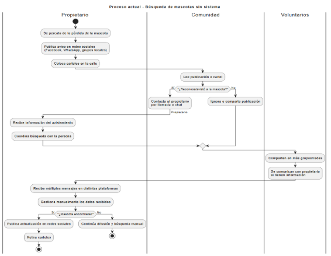

`                   `*Fuente: Elaboración Propia*
###

1) ### **Diagrama del Proceso Propuesto - Diagrama de actividades Inicial**
`	 `*Figura 02. Diagrama del Proceso Propuesto- Diagrama de actividades*

`	                                        `*Fuente: Elaboración Propia*			

1. ## **Especificación de Requerimientos de Software**
1) ### **Cuadro de Requerimientos Funcionales**
   **                         *Tabla 02. Cuadro de Requerimientos Funcionales*

|**Código**|**Requerimiento**|**Descripción**|
| - | - | - |
|RF-01|Autenticar usuario|La aplicación debe permitir que los usuarios inicien sesión utilizando su correo electrónico y contraseña, verificando sus credenciales para acceder al sistema.|
|RF-02|Registrar usuario|La aplicación debe permitir a los nuevos usuarios crear una cuenta ingresando sus datos personales como nombre, correo electrónico, contraseña y número de contacto.|
|RF-03|Registrar veterinario|La aplicación debe permitir que se registren veterinarios autorizados, asociándose a un perfil especial con permisos definidos.|
|RF-04|Registrar reporte de mascota|La aplicación debe permitir a los usuarios registrar un reporte de mascota, incluyendo nombre, tipo, descripción, imagen, contacto y ubicación.|
|RF-05|Visualizar mascotas reportadas|La aplicación debe mostrar un listado con todos los reportes de mascotas que necesiten ayuda.|
|RF-06|Comunicar usuarios|La aplicación debe permitir que los usuarios se comuniquen mediante un chat interno para coordinar el reencuentro de mascotas.|
|RF-07|Gestionar panel de usuario|La aplicación debe contar con un panel donde el usuario pueda gestionar su información personal, ver sus reportes registrados, historial de chats, y acceder a funcionalidades principales.|
|RF-08|Gestionar panel de veterinario|La aplicación debe ofrecer un panel exclusivo para veterinarios donde puedan consultar reportes relevantes, validar información y apoyar en la verificación de mascotas.|
|RF-09|Gestionar panel del Administrador|Debe permitir al administrador visualizar reportes detallados basados en un rango de fechas seleccionado. Esto incluiría información relacionada respecto a las mascotas perdidas y encontradas, en adopción y adoptadas, en ayuda y atendidas.|
|RF-10|Procesar imágenes con modelo pre entrenado|La aplicación debe utilizar un modelo de inteligencia artificial preentrenado para extraer características básicas de las imágenes de mascotas registradas, facilitando la identificación y comparación entre reportes.|
|RF-11|Generar descriptores propios|El sistema debe generar descriptores adicionales a partir de las imágenes cargadas, con el fin de enriquecer la representación visual de cada mascota y mejorar la precisión en el proceso de búsqueda.|
|RF-12|Implementar algoritmo de matching y ranking|La aplicación debe implementar un algoritmo de coincidencia y ranking que compara los descriptores de nuevas imágenes contra la base de datos de reportes, mostrando un listado ordenado de posibles coincidencias con un puntaje de similitud.|
|RF-13|Generar pipeline de validación de datos|El sistema debe contar con un pipeline automatizado que valide los datos ingresados (imágenes, descripciones, contactos y ubicaciones), garantizando la consistencia, integridad y calidad de la información antes de publicarse.|

*Fuente: Elaboración Propia*

1) ### **Cuadro de Requerimientos No Funcionales**
`	                                  `*Tabla 03. Cuadro de Requerimientos no funcionales*

|**Código**|**Requerimiento**|**Descripción**|
| - | - | - |
|RNF-01|Rendimiento|La aplicación debe procesar las operaciones críticas (listar reportes, mostrar mapa) en un tiempo máximo de 5 segundos en al menos el 95% de los casos, bajo condiciones de red estable.|
|RNF-02|Disponibilidad|La aplicación debe estar disponible al menos el 99% del tiempo en un periodo mensual, excluyendo mantenimientos programados.|
|RNF-03|Usabilidad|La aplicación debe permitir que un usuario sin experiencia pueda registrar un reporte completo en menos de 3 minutos y navegar entre pantallas en un máximo de 3 clics.|

`	                                                           `Fuente: Elaboración Propia	
1) ### **Reglas de Negocio**
   **                             *Tabla 04. Cuadro de Reglas de Negocio*

|**Código**|**Regla de Negocio**|**Descripción**|
| - | - | - |
|RN-01|Registro único de usuario|Cada usuario debe estar registrado con un correo electrónico único. No se permite duplicidad de cuentas con el mismo correo.|
|RN-02|Validación de datos obligatorios|Todos los campos requeridos al registrar un reporte de mascota (nombre, tipo, contacto, descripción, imagen y ubicación) deben ser obligatorios.|
|RN-03|Reportes visibles solo si están validados|Solo los reportes validados por el sistema (con todos los datos completos) serán visibles en los listados públicos.|
|RN-04|Comunicación entre usuarios restringida a reportes|El chat estará habilitado únicamente entre usuarios que hayan interactuado con un mismo reporte (pérdida o hallazgo de mascota).|
|RN-05|Actualización y edición limitada de reportes|Los usuarios solo podrán editar sus reportes dentro de las primeras 24 horas de haberlos creado. Después, solo podrán ser eliminados.|
|RN-06|Protección de datos personales|No se mostrará públicamente información sensible como números de documento, correo o dirección exacta, solo medios de contacto autorizados.|

`                                                        `*Fuente: Elaboración propia*
1. ## **Fases de Desarrollo**
1. ### **Perfiles de Usuario**
   **                              *Tabla 05. Cuadro de Perfiles de Usuario*	

|**Perfil**|**Descripción**|
| - | - |
|**Usuario**|Es el ciudadano que usa la aplicación para reportar una mascota perdida o encontrada. Puede consultar reportes, registrar nuevos, chatear con otros usuarios y filtrar por ubicación o tipo de mascota. Tiene acceso a su panel personal.|
|
**Veterinario**

|Es un profesional acreditado que puede ofrecer apoyo en reportes, verificar el estado de algunas mascotas y brindar asistencia. Debe ser validado por un administrador antes de acceder al sistema. Puede acceder a un panel especial donde puede ver reportes relacionados a su zona o casos derivados por usuarios.|

`                                      `*Fuente: Elaboración Propia*
1. ### **Modelo Conceptual**
1) #### **Diagrama de Paquetes** 
   `                  `*Figura 03. Diagrama de Paquete del sistema móvil SOS Mascota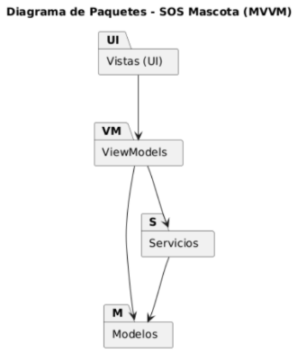*

`                                                 `*Fuente: Elaboración Propia*

1) #### **Diagrama de Casos de Uso**
   En este apartado se presenta el diagrama de paquetes, el cual permite visualizar la estructura general del sistema. 

   `           `*Figura 04. Diagrama de Casos de Uso del Sistema Web SOSMascota*

   El diagrama de casos de uso trabaja con dos actores, usuario y veterinario, con el propósito de visualizar los casos de uso con los que cada uno interactúa

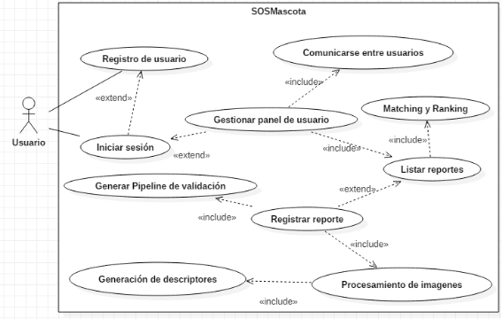

`                                                 `*Fuente: Elaboración Propia*

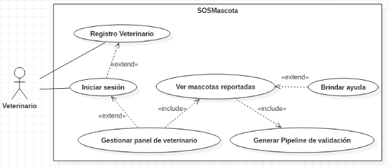

`                                                `*Fuente: Elaboración Propia*
1) #### **Escenarios de Caso de Uso**
**Narrativa de CU - 01:** “Autenticar usuario”

*Tabla 06. Narrativa de CU-01 “Autenticación de usuario”* 
|**Caso de Uso**|Autenticar usuario|CU - 01|
| - | - | - |
|**Actores**|Usuario||
|**Descripción**|Permite registrarse, iniciar sesión y cerrar sesión de forma segura.||
|**Precondiciones**|Ninguna para registro; para iniciar sesión, estar registrado.||
|

**Flujo Normal**
|**Acción:** Autenticar, Registrar||
||**ACCIÓN DEL ACTOR**|**CURSO DEL SISTEMA**|
||1. Ingresa a la página de inicio.|2. Muestra interfaz de inicio de sesión con campos de usuario y contraseña, y opción de registrarse.|
||3. Completa credenciales y selecciona “Ingresar”.|4. Valida credenciales; si son correctas, redirige a la interfaz inicial.|
||5. Si no tiene cuenta, selecciona “Registrarse”.|6. Muestra el formulario de registro.|
||7. Completa datos y confirma.|8. Valida y registra al usuario, luego redirige a inicio de sesión.|

`                                                      `*Fuente: Elaboración Propia*

**Narrativa de CU - 02:** “Registrar usuario”

*Tabla 07. Narrativa de CU-02 “Registrar usuario”* 
|**Caso de Uso**|Registrar usuario|CU - 02|
| - | - | - |
|**Actores**|Usuario||
|**Descripción**|Permite a un nuevo usuario registrarse ingresando sus datos personales.||
|**Precondiciones**|No estar registrado.||
|

**Flujo Normal**
|**Acción:** Registrar usuario||
||**ACCIÓN DEL ACTOR**|**CURSO DEL SISTEMA**|
||1. Selecciona “Registrarse”.|2. Muestra el formulario de registro.|
||3. Completa los datos requeridos.|4. Valida información.|
||5. El usuario confirma el registro.|6. El sistema crea la cuenta y muestra un mensaje de éxito.|
||7. Confirma el registro.|8. Crea cuenta y muestra mensajes de éxito.|

`                                                      `*Fuente: Elaboración Propia*

**Narrativa de CU - 03:** “Registrar veterinario”

*Tabla 08. Narrativa de CU-03 “Registrar veterinario”* 
|**Caso de Uso**|Registrar veterinario|CU - 03|
| - | - | - |
|**Actores**|Veterinario, Administrador||
|**Descripción**|Permite registrar a un veterinario con perfil validado por un administrador.||
|**Precondiciones**|El veterinario debe presentar credenciales válidas.||
|

**Flujo Normal**
|**Acción:** ||
||**ACCIÓN DEL ACTOR**|**CURSO DEL SISTEMA**|
||1. Administrador selecciona “Registrar veterinario”.|2. Muestra el formulario de registro.|
||3. Ingresa datos del veterinario.|4. Valida información.|
||5. Confirma el registro.|6. Crea perfil con permisos especiales.|

`	                                               `*Fuente: Elaboración Propia*

**Narrativa de CU - 04:** “Registrar reporte de mascota”

*Tabla 09. Narrativa de CU-04 “Registrar reporte de mascota”* 
|**Caso de Uso**|Registrar reporte de mascota|CU - 04|
| - | - | - |
|**Actores**|Usuario||
|**Descripción**|Permite registrar mascota perdida o encontrada con foto, ubicación y contacto.||
|**Precondiciones**|El usuario debe estar autenticado.||
|

**Flujo Normal**
|**Acción:** ||
||**ACCIÓN DEL ACTOR**|**CURSO DEL SISTEMA**|
||1. El usuario selecciona “Nuevo Reporte”.|2. El sistema muestra el formulario de reporte.|
||3. El usuario ingresa los datos obligatorios.|4. El sistema valida la información y la imagen.|
||5. El usuario confirma el registro.|6. El sistema almacena el reporte y lo publica.|

`	                                              `*Fuente: Elaboración Propia*

**Narrativa de CU - 05:** “Visualizar mascotas reportadas”

*Tabla 10. Narrativa de CU-05 “ Visualizar mascotas reportadas”*
|**Caso de Uso**|Visualizar mascotas reportadas|CU - 05|
| - | - | - |
|**Actores**|Usuario, Veterinario, Administrador||
|**Descripción**|Permite consultar los reportes de mascotas con filtros de búsqueda.||
|**Precondiciones**|Deben existir reportes registrados.||
|

**Flujo Normal**
|**Acción:** Consultar reportes||
||**ACCIÓN DEL ACTOR**|**CURSO DEL SISTEMA**|
||1. El usuario accede a “Ver Reportes”.|2. El sistema muestra la lista de mascotas reportadas.|
||3. El usuario aplica filtros (tipo, ubicación, fecha).|4. El sistema actualiza los resultados filtrados.|

`	                                               `*Fuente: Elaboración Propia*

**Narrativa de CU - 06:** “Comunicarse entre usuarios”

*Tabla 11. Narrativa de CU-06 “ Comunicarse entre usuarios”*
|**Caso de Uso**|Comunicarse entre usuarios|CU - 06|
| - | - | - |
|**Actores**|Usuario||
|**Descripción**|Permite a los usuarios comunicarse a través de un chat interno relacionado con un reporte.||
|**Precondiciones**|El usuario debe estar autenticado y vinculado a un reporte.||
|

**Flujo Normal**
|**Acción:** ||
||**ACCIÓN DEL ACTOR**|**CURSO DEL SISTEMA**|
||1. El usuario selecciona un reporte.|2. El sistema muestra la opción de chat.|
||3. El usuario escribe un mensaje.|4. El sistema guarda y muestra el mensaje al otro usuario.|

`                                                          `*Fuente: Elaboración Propia*

**Narrativa de CU - 07:** “Gestionar panel de usuario”

*Tabla 12. Narrativa de CU-07 “Gestionar panel de usuario”*
|**Caso de Uso**|Gestionar panel de usuario|CU - 07|
| - | - | - |
|**Actores**|Usuario||
|**Descripción**|Permite al usuario gestionar su perfil, reportes y chats.||
|**Precondiciones**|El usuario debe estar autenticado.||
|

**Flujo Normal**
|**Acción:** ||
||**ACCIÓN DEL ACTOR**|**CURSO DEL SISTEMA**|
||1. El usuario accede al panel.|2. El sistema muestra la información personal y opciones.|
||3. El usuario actualiza datos o revisa reportes.|4. El sistema guarda cambios y muestra confirmación.|

`                                                          `*Fuente: Elaboración Propia*

**Narrativa de CU - 08:** “Gestionar panel de veterinario”

*Tabla 13. Narrativa de CU-08 “Gestionar panel de veterinario”*
|**Caso de Uso**|Gestionar panel de veterinario|CU - 08|
| - | - | - |
|**Actores**|Veterinario||
|**Descripción**|Permite a los veterinarios consultar reportes y validar información.||
|**Precondiciones**|El veterinario debe estar registrado y validado.||
|

**Flujo Normal**
|**Acción:** ||
||**ACCIÓN DEL ACTOR**|**CURSO DEL SISTEMA**|
||1. El veterinario accede a su panel.|2. El sistema muestra los reportes relacionados a su zona.|
||3. El veterinario valida un reporte.|4. El sistema actualiza el estado del reporte como “validado”.|

`                                                          `*Fuente: Elaboración Propia*

**Narrativa de CU - 09:** “Gestionar panel del Administrador”

*Tabla 14. Narrativa de CU-09 “Gestionar panel del Administrador”*
|**Caso de Uso**|Gestionar panel de veterinario|CU - 09|
| - | - | - |
|**Actores**|Administrador||
|**Descripción**|Permite al administrador acceder a su panel para visualizar métricas, reportes y estadísticas del sistema, filtrando por rangos de fechas y categorías de estado de las mascotas (perdidas, encontradas, en adopción, adoptadas, en ayuda y atendidas).||
|**Precondiciones**|El administrador debe estar autenticado en el sistema y tener permisos de acceso al panel.||
|

**Flujo Normal**
|**Acción:** Consultar y gestionar panel de administrador||
||**ACCIÓN DEL ACTOR**|**CURSO DEL SISTEMA**|
||1. El administrador accede a la opción “Panel de administrador” desde el menú principal.|2. El sistema muestra la interfaz del panel con opciones de filtros y visualización de datos.|
||3. Selecciona un rango de fechas y/o categorías de estado de mascotas.|4. .El sistema procesa la solicitud y filtra la información.|
||5. Solicita la generación de un reporte detallado.|6. El sistema genera y muestra el reporte con métricas, gráficos y estadísticas correspondientes.|
||7. ` `Revisa la información y, si es necesario, exporta o guarda el reporte.|8. El sistema confirma la exportación o guarda el reporte según la acción solicitada.|

`                                                          `*Fuente: Elaboración Propia*

**Narrativa de CU - 10:** “Procesar imágenes con modelo pre entrenado”

*Tabla 15. Narrativa de CU-10 “Procesar imágenes con modelo pre entrenado”*
|**Caso de Uso**|Procesar imágenes con modelo pre entrenado|CU - 10|
| - | - | - |
|**Actores**|Sistema||
|**Descripción**|Permite extraer características de una imagen de mascota con un modelo preentrenado.||
|**Precondiciones**|El usuario debe subir una imagen.||
|

**Flujo Normal**
|**Acción:** ||
||**ACCIÓN DEL ACTOR**|**CURSO DEL SISTEMA**|
||1. El usuario adjunta una foto en un reporte.|2. El sistema procesa la imagen con el modelo pre entrenado y extrae características.|

`                                                          `*Fuente: Elaboración Propia*

**Narrativa de CU - 11:** “Generar descriptores propios”

*Tabla 16. Narrativa de CU-11 “Generar descriptores propios”*
|**Caso de Uso**|Generar descriptores propios|CU - 11|
| - | - | - |
|**Actores**|Sistema||
|**Descripción**|Permite enriquecer la representación visual de las imágenes cargadas.||
|**Precondiciones**|Debe existir una imagen cargada.||
||**Acción:** ||
||**ACCIÓN DEL ACTOR**|**CURSO DEL SISTEMA**|
||1. El usuario sube la imagen.|2. El sistema genera descriptores adicionales de la imagen.|

`                                                          `*Fuente: Elaboración Propia*

**Narrativa de CU - 12:** “Implementar algoritmo de matching y ranking”

*Tabla 17. Narrativa de CU-12 “Implementar algoritmo de matching y ranking”*
|**Caso de Uso**|Algoritmo de Matching y Ranking|CU - 12|
| - | - | - |
|**Actores**|Usuario, Sistema||
|**Descripción**|Compara la imagen cargada con la base de datos y muestra coincidencias ordenadas.||
|**Precondiciones**|El usuario debe registrar un reporte con imagen.||
|

**Flujo Normal**
|**Acción:** ||
||**ACCIÓN DEL ACTOR**|**CURSO DEL SISTEMA**|
||1. El usuario sube la foto de su mascota perdida.|2. El sistema compara con la base de datos y muestra un ranking de coincidencias.|

`                                                        `*Fuente: Elaboración Propia*

**Narrativa de CU - 13:** “Generar pipeline de validación de datos”

*Tabla 18. Narrativa de CU-13 “Generar pipeline de validación de datos”*
|**Caso de Uso**|Pipeline de validación de datos|CU - 13|
| - | - | - |
|**Actores**|Sistema||
|**Descripción**|Verifica que los datos ingresados cumplan requisitos de integridad antes de publicarse.||
|**Precondiciones**|El usuario debe completar un formulario de reporte.||
|

**Flujo Normal**
|**Acción:** ||
||**ACCIÓN DEL ACTOR**|**CURSO DEL SISTEMA**|
||1. El usuario completa el formulario de reporte.|2. El sistema valida campos obligatorios, formatos de imagen y consistencia de datos.|
|||3. Si los datos son correctos, se publica el reporte; si no, muestra un mensaje de error.|

`                                                          `*Fuente: Elaboración Propia*

1. ### **Modelo Lógico**
En este apartado se desarrolla el modelo lógico del sistema, el cual permite representar de manera estructurada la dinámica y comportamiento del software desde una perspectiva técnica. Se incluyen el análisis de objetos, así como los diagramas de actividades y diagramas de secuencia, que describen cómo interactúan los componentes del sistema y los flujos de información entre ellos. 
1) #### **Análisis de Objetos**
   El análisis de objetos permite identificar y definir las principales clases, atributos y relaciones que forman parte del sistema. 

`                                           `*Tabla 19. Objetos de Entidad*

Los objetos entidad representan las principales entidades de datos dentro del sistema, que son responsables de almacenar la información esencial del negocio. 

|**Objeto de Entidad**|**Descripción**|
| - | - |
|Usuario|id, nombre, correo, rol|
|Mascota|id, nombre, descripcion, tipo, estado, latitud, longitud, fecha, url Imagenes, uidUsuario|

`	                                      `*Fuente: Elaboración Propia*

Estos objetos gestionan los datos persistentes del sistema, asegurando que la información se mantenga organizada y accesible para su procesamiento.

Actúan como un modelo de la base de datos, sirviendo de base para la implementación de las tablas y relaciones en el diseño físico.

La relación principal es que un Usuario puede registrar una o varias Mascotas, mientras que cada Mascota está asociada a un único Usuario mediante idUsuario.

`                                      `*Tabla 20. Objetos de Control*

Los objetos control gestionan la lógica de negocio y el flujo de trabajo dentro del sistema, permitiendo la ejecución de acciones y la validación de datos. 

|**Objeto de Control**|**Descripción**|
| - | - |
|ControlAutenticacion|Gestiona el inicio de sesión y la validación de credenciales del usuario.|
|ControlReportes|Administra la creación y listado de reportes de mascotas perdidas o encontradas.|
|ControlMascota|Controla la gestión de la información relacionada a la mascota del reporte.|
|ControlUbicacion|Gestiona la información de veterinarios (registro y validación local).|
|ControlChat|Coordina la interacción entre usuarios mediante mensajes.|

`                                `*Fuente: Elaboración Propia*

Estos objetos orquestan las interacciones entre los objetos entidad y los objetos frontera. Se encargan de procesar las solicitudes del usuario, realizar las validaciones necesarias y gestionar la lógica que permite que el sistema funcione correctamente. 

                                   *Tabla 21. Objetos de Frontera*

Los objetos frontera corresponden a los elementos de la interfaz de usuario con los que los administradores y usuarios interactúan directamente en la aplicación

|**Objeto de Frontera**|**Función en la Interfaz**|
| - | - |
|PantallaLogin|Permite al usuario autenticarse.|
|PantallaRegistro|Permite el registro como usuario o veterinario.|
|PantallaInicio|Muestra el menú principal según el tipo de usuario.|
|PantallaReportarMascota|Formulario para registrar mascotas perdidas o encontradas.|
|PantallaListaReportes|Muestra reportes con filtros por tipo o fecha.|
|PantallaMascotaDetalle|Visualiza el detalle de un reporte de mascota.|
|PantallaChat|Interfaz para mensajería entre usuarios.|
|PantallaUbicacion|Muestra en mapa la última ubicación conocida.|

                                                        Fuente: Elaboración Propia

Estos objetos gestionan la comunicación entre el usuario y el sistema. Son responsables de captar las entradas del usuario y mostrar la información procesada de manera que sea comprensible y útil para la toma de decisiones.
1) #### **Diagrama Secuencia:**
   Este diagrama representa el flujo de trabajo del sistema, integrando tanto las actividades como los objetos que intervienen. 

   *Figura 05. Diagrama de Secuencia CU-01 “ Autenticación de usuario”*

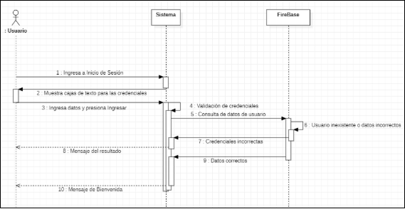

`  	                                                         `*Fuente: Elaboración Propia*

El diagrama de flujo presentado describe el proceso de inicio de sesión de un sistema. Comienza con el acceso a la pantalla de inicio, donde se muestran cajas de texto para ingresar las credenciales. El usuario introduce sus datos y procede a gestionar el ingreso, lo que activa una validación de las credenciales. Si el usuario no existe o los datos son incorrectos, se muestra un mensaje de error; de lo contrario, si las credenciales son correctas, se consultan los datos del usuario y se muestra un mensaje de éxito. Finalmente, se incluye un mensaje de "Elementos" como parte del flujo.

RF-02 Registrar usuario

`	`Figura 06. Diagrama de Secuencia CU-02 “Registrar usuario”

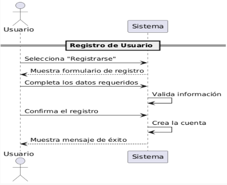

`                                               `*Fuente: Elaboración Propia*

El diagrama de flujo representa el proceso de registro de un usuario en un sistema, mostrando la interacción entre el "Usuario" y el "Sistema" en seis pasos clave. Comienza cuando el usuario selecciona la opción de registrarse, lo que activa la visualización del formulario. Luego, el usuario completa los datos requeridos, y el sistema valida esa información. Si todo está correcto, el sistema crea la cuenta y muestra un mensaje de éxito. Este flujo refleja de forma clara y ordenada cómo se desarrolla la funcionalidad de registro, facilitando su comprensión y diseño dentro de una aplicación.

RF-03 Registrar veterinario

*Figura 07. Diagrama de Secuencia CU-03 “Registrar veterinario”*

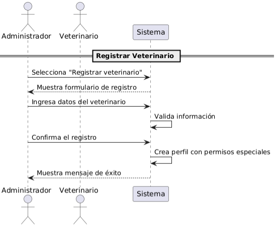

`                                                        `*Fuente: Elaboración Propia*

El diagrama de flujo representa el proceso de registro de un veterinario en el sistema, mostrando la interacción entre el "Administrador", el "Veterinario" y el "Sistema" en siete pasos clave. El proceso inicia cuando el administrador selecciona la opción de registrar veterinario, lo que activa la visualización del formulario de registro. Luego, el administrador ingresa los datos del veterinario, y el sistema procede a validar la información. Si todo está correcto, el sistema confirma el registro, crea un perfil con permisos especiales y muestra un mensaje de éxito. Este flujo refleja de manera clara y estructurada cómo se gestiona el alta de un profesional dentro de la plataforma, facilitando su implementación y comprensión en el desarrollo de sistemas de gestión veterinaria.

RF-04 Registrar reporte de mascota

*Figura 08. Diagrama de Secuencia CU-04 “Registrar reporte de mascota”*

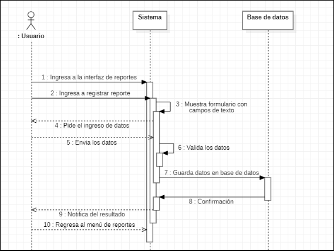

`                                                            `*Fuente: Elaboración Propia*

El diagrama de flujo representa el proceso de registro de un reporte en el sistema, mostrando la interacción entre el "Usuario", el "Sistema" y la "Base de datos" en diez pasos secuenciales. El proceso inicia cuando el usuario accede a la interfaz de reportes y selecciona la opción para registrar uno nuevo. El sistema muestra un formulario con campos de texto y solicita el ingreso de datos. Una vez que el usuario envía la información, el sistema la valida y la guarda en la base de datos. Tras recibir la confirmación de almacenamiento, el sistema notifica el resultado al usuario, quien finalmente regresa al menú de reportes. Este flujo permite visualizar de forma clara y estructurada cómo se gestiona el registro de reportes dentro de la aplicación, facilitando su análisis y desarrollo.

RF-05 Visualizar mascotas reportadas

*Figura 09. Diagrama de Secuencia CU-05 “Visualizar mascotas reportadas”*

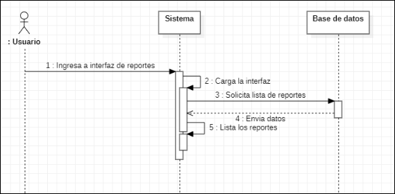

`  	                                                `*Fuente: Elaboración Propia*

Este diagrama de secuencia representa el flujo de interacción entre un usuario, el sistema y la base de datos al acceder a una interfaz de reportes. Comienza cuando el usuario ingresa a dicha interfaz, lo que activa al sistema para cargarla. Luego, el sistema solicita a la base de datos la lista de reportes disponibles. La base de datos responde enviando los datos solicitados, y finalmente el sistema muestra al usuario la lista de reportes. Este tipo de diagrama es útil para visualizar cómo se distribuyen las responsabilidades entre los componentes y cómo fluye la información en tiempo real dentro de una aplicación.

RF-06 Comunicarse entre usuarios

*Figura 10. Diagrama de Secuencia CU-06 “Comunicarse entre usuarios”*

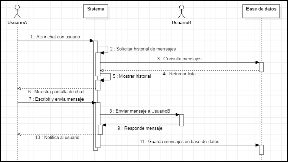

`                                                          `*Fuente: Elaboración Propia*

Este diagrama de secuencia muestra cómo se desarrolla una sesión de chat entre dos usuarios dentro de un sistema. Todo comienza cuando el Usuario abre el chat con otro usuario, lo que activa al sistema para solicitar el historial de mensajes. El sistema consulta la base de datos, recibe la lista de mensajes y la muestra en pantalla junto con la interfaz de chat. Luego, el Usuario escribe y envía un mensaje, que el sistema transmite al Usuario. El Usuario respondió, y el sistema notifica al Usuario de la respuesta. Finalmente, todos los mensajes intercambiados se guardan en la base de datos. Este flujo refleja claramente cómo se gestionan las comunicaciones en tiempo real, asegurando que los usuarios puedan interactuar fluidamente mientras el sistema mantiene la persistencia de los datos.

RF-07 Gestionar panel de Usuario

*Figura 11. Diagrama de Secuencia CU-07 “Gestionar panel de Usuario”*

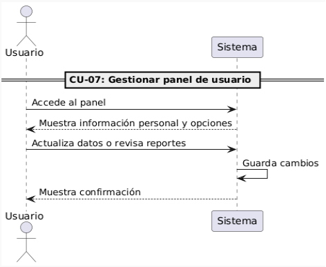

`                                                         `*Fuente: Elaboración Propia*

Este diagrama de secuencia representa el proceso de gestión del panel de usuario dentro de un sistema. El flujo inicia cuando el usuario accede al panel, lo que activa al sistema para mostrar su información personal junto con las opciones disponibles. Luego, el usuario puede actualizar sus datos o revisar reportes, y el sistema guarda los cambios realizados. Finalmente, se muestra una confirmación al usuario. Este tipo de diagrama es útil para visualizar cómo se desarrollan las interacciones en una interfaz orientada al usuario, asegurando que cada acción tenga una respuesta clara y que los datos se gestionan de forma estructurada.

RF-08 Gestionar panel de Veterinario

*Figura 12. Diagrama de Secuencia CU-08 “Gestionar panel de Veterinario”*

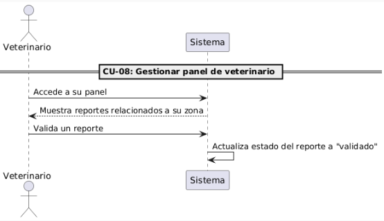

`                                                        `*Fuente: Elaboración Propia*

Este diagrama de secuencia describe el proceso de gestión del panel de veterinario dentro de un sistema. El flujo comienza cuando el veterinario accede a su panel, lo que activa al sistema para mostrarle los reportes relacionados con su zona de responsabilidad. Luego, el veterinario válida uno de esos reportes, y el sistema actualiza automáticamente el estado del reporte a “validado”. Este tipo de representación es útil para entender cómo se estructuran las acciones dentro de una interfaz especializada, asegurando que cada paso esté claramente definido y que las validaciones se registren correctamente en el sistema.

RF-09 Gestionar panel de Administrador

            *Figura 13. Diagrama de Secuencia CU-09 “Gestionar panel de Administrador”*

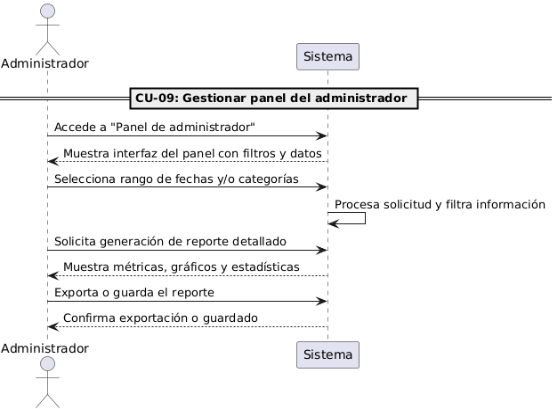

`                                                          `*Fuente: Elaboración Propia*

Este diagrama de secuencia detalla el proceso de gestión del panel del administrador dentro de un sistema. El flujo comienza cuando el administrador accede al panel, lo que activa al sistema para mostrar la interfaz con filtros y datos disponibles. Luego, el administrador selecciona un rango de fechas y/o categorías, y el sistema procesa esa solicitud filtrando la información correspondiente. A continuación, el administrador solicita la generación de un reporte detallado, y el sistema responde mostrando métricas, gráficos y estadísticas. Finalmente, el administrador exporta o guarda el reporte, y el sistema confirma que la acción se ha realizado correctamente. Este tipo de diagrama es esencial para comprender cómo se estructuran las funcionalidades administrativas, permitiendo una gestión eficiente y basada en datos.

RF-10 Procesar imágenes con modelo pre entrenado

*Figura 14. Diagrama de Secuencia CU-10 “ Procesar imágenes con modelo pre entrenado”*

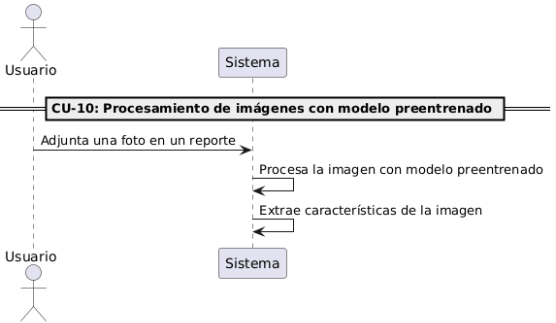

`                                                       `*Fuente: Elaboración Propia*

Este diagrama de caso de uso representa el proceso de procesamiento de imágenes mediante un modelo preentrenado dentro de un sistema. El flujo inicia cuando el usuario adjunta una foto como parte de un reporte. El sistema, al recibir la imagen, la procesa utilizando un modelo de aprendizaje automático previamente entrenado. Como resultado de este procesamiento, el sistema extrae características relevantes de la imagen, que pueden ser utilizadas para análisis, clasificación o validación. Este tipo de diagrama es clave para entender cómo se integra la inteligencia artificial en el flujo de trabajo del sistema, permitiendo automatizar tareas complejas y mejorar la eficiencia en el manejo de reportes visuales.

`	`RF-11 Generar descriptores propios

`	`*Figura 15. Diagrama de Secuencia CU-11 “Generar descriptores propios”*

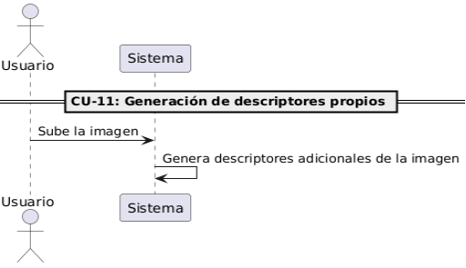

`                                                        `*Fuente: Elaboración Propia*

Este diagrama de caso de uso representa el proceso de generar descriptores propios a partir de una imagen subida por el usuario. El flujo comienza cuando el usuario carga una imagen en el sistema, lo que activa el procesamiento automático por parte del sistema para generar descriptores adicionales. Estos descriptores permiten enriquecer la información visual de la imagen, facilitando tareas como clasificación, búsqueda o análisis posterior. Este tipo de funcionalidad es clave en sistemas que requieren interpretación avanzada de imágenes, ya que permite extraer metadatos personalizados que mejoran la precisión y utilidad del contenido visual.

`	`RF-12 Generador de Algoritmo de Matching y Ranking

*Figura 16. Diagrama de Secuencia CU-12 “Generador de Algoritmo de Matching y Ranking”*

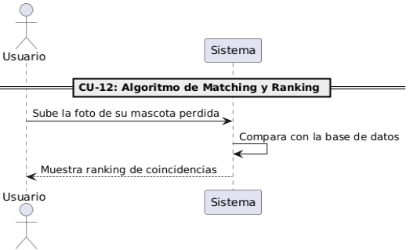

`                                                    `*Fuente: Elaboración Propia*

Este diagrama de secuencia representa el proceso de identificación de una mascota perdida mediante un algoritmo de coincidencia y ranking. El flujo comienza cuando el usuario sube una foto de su mascota extraviada al sistema. A partir de esa imagen, el sistema realiza una comparación con las fotos almacenadas en su base de datos, buscando similitudes relevantes. Luego, el sistema muestra un ranking de coincidencias, ordenando los posibles resultados según el nivel de similitud. Esta funcionalidad es fundamental en plataformas de búsqueda de mascotas, ya que permite agilizar la identificación visual y aumentar las probabilidades de reencuentro entre el dueño y su mascota.

RF-13 Generador de Pipeline de validación de datos

*Figura 17. Diagrama de Secuencia CU-13 “Generador de Pipeline de validación de datos”*

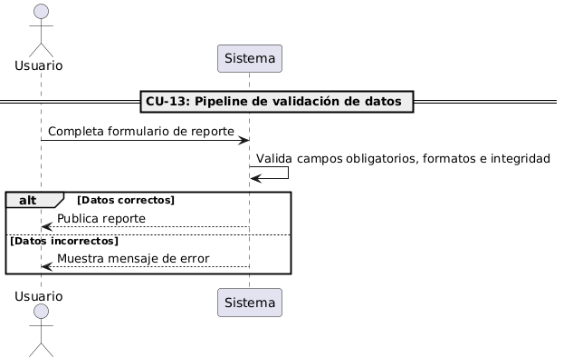

`                                                          `*Fuente: Elaboración Propia*

Este diagrama de secuencia representa el flujo de validación de datos dentro de un sistema, específicamente en el contexto de completar un formulario de reporte. El proceso inicia cuando el usuario llena el formulario, lo que activa al sistema para validar los campos obligatorios, los formatos y la integridad de los datos ingresados. A partir de esta validación, se presentan dos posibles caminos: si los datos son correctos, el sistema procede a publicar el reporte; si los datos son incorrectos, se muestra un mensaje de error al usuario. Este tipo de diagrama es esencial para garantizar la calidad de la información que ingresa al sistema, asegurando que solo se procesen datos confiables y bien estructurados.

1) #### **Diagrama de Clases**
        	        *Figura 18: Diagrama de Clases del Sistema SOSMascota*

                      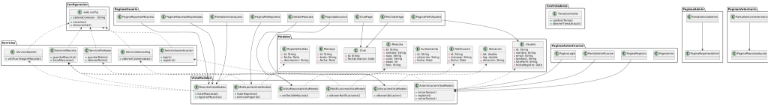

                                                       *Fuente: Elaboración Propia*

## **Conclusiones**
- El sistema SOSMascota ofrece una solución tecnológica eficiente para la problemática de mascotas perdidas, encontradas o en adopción, al centralizar en una sola plataforma el registro de reportes, la validación de información y la comunicación entre usuarios, veterinarios y administradores.
- La implementación de modelos de inteligencia artificial (procesamiento de imágenes, generación de descriptores y algoritmos de matching y ranking) permite mejorar significativamente la búsqueda de coincidencias, incrementando las posibilidades de recuperar a las mascotas extraviadas.
- La definición clara de casos de uso, junto con los diagramas de secuencia y la identificación de objetos de entidad, control e interfaz, asegura una arquitectura de software robusta, escalable y alineada a los objetivos del sistema.
- La inclusión de roles diferenciados (usuario, veterinario y administrador) garantiza un control adecuado de la información, fortaleciendo la confiabilidad, seguridad y trazabilidad de los datos dentro de la plataforma.
- El sistema no solo contribuye a la recuperación de mascotas, sino que también promueve la conciencia social y el bienestar animal, generando un impacto positivo tanto en los dueños de mascotas como en la comunidad en general.

