
` `****

** 

**UNIVERSIDAD PRIVADA DE TACNA**

**FACULTAD DE INGENIERÍA**

**Escuela Profesional de Ingeniería de Sistemas**

**Desarrollo de Aplicativo Móvil “SOS Mascota”**

Curso: Calidad y Pruebas de Software

Docente: Mag. Patrick Cuadros Quiroga

Integrantes:

- Christian Dennis Hinojosa Mucho		(2019065161)
- Royser Alonsso Villanueva Mamani		(2021071090)
- Gilmer Donaldo Mamani Condori		(2012042779)

**Tacna – Perú**

**2025**

**Desarrollo de Aplicativo Móvil “SOS Mascota”** 

**Documento de Arquitectura de Software**

**Versión 2.0**

|CONTROL DE VERSIONES||||||
| :-: | :- | :- | :- | :- | :- |
|Versión|Hecha por|Revisada por|Aprobada por|Fecha|Motivo|
|1\.0|Christian HInjosa Royser Villanueva|Christian HInjosa Royser Villanueva|Christian HInjosa Royser Villanueva|19/09/2025|Versión Original|
|2\.0|Christian HInjosa Royser Villanueva|Christian HInjosa Royser Villanueva|Christian HInjosa Royser Villanueva|20/10/2025|Versión 2.0|

**ÍNDICE**

[**1. Introducción	5**](#_heading=h.68bj0ctrkg4i)

[1.1. Propósito	5](#_heading=h.qe8vaqcu4i7t)

[1.2. Alcance	5](#_heading=h.1dm33h7c745a)

[1.3. Definición, siglas y abreviaturas	6](#_heading=h.a016q4ja3wu3)

[1.4. Referencias	7](#_heading=h.x0bmnzftwezx)

[1.5. Visión General	7](#_heading=h.o1u1y39861dc)

[**2. Representación Arquitectónica	8**](#_heading=h.x0tmfg4rpcm)

[2.1. Escenarios	8](#_heading=h.fhksncadg16v)

[2.2. Vista Lógica	8](#_heading=h.o6qz4g7rqyxv)

[2.3. Vista del Proceso	9](#_heading=h.mi70ilumjz3c)

[2.4. Vista del desarrollo	10](#_heading=h.d4tqo9lg9smu)

[2.5. Vista Física	10](#_heading=h.qu3x4ci80fsm)

[**3. Objetivos y limitaciones arquitectónicas	11**](#_heading=h.6p0umdi30unj)

[3.1. Rendimiento	11](#_heading=h.ejrbc0h6kre7)

[3.2. Disponibilidad	11](#_heading=h.5i12715u9nui)

[3.3. Usabilidad	12](#_heading=h.l2wkj7y5bt1j)

[**4. Análisis de Requerimientos	13**](#_heading=h.cgzwbwmhp1v)

[4.1. Requerimientos funcionales	13](#_heading=h.d3296d272ka8)

[4.2. Requerimientos no funcionales	16](#_heading=h.s0f7jl62nr5j)

[**5. Vistas de Caso de Uso	16**](#_heading=h.wk9p4plmjsud)

[**6. Vista Lógica	22**](#_heading=h.1a69gih1o8cs)

[6.1. Diagrama Contextual	22](#_heading=h.2qgdz0v7c57c)

[**7. Vista de Procesos	24**](#_heading=h.tjv60821meu3)

[7.1. Diagrama de Proceso Actual	24](#_heading=h.mfnz76cvqfvg)

[7.2. Diagrama de Proceso Propuesto	25](#_heading=h.27j53vf2vqb3)

[**8. Vista de Despliegue	26**](#_heading=h.ru2tkhpg60vd)

[8.1. Diagrama de Contenedor	26](#_heading=h.f12hf6ss5uco)

[**9. Vista de Implementación	26**](#_heading=h.r0lbewm8uh50)

[9.1. Diagrama de Componentes	26](#_heading=h.vsxdke6vfiql)

[**10. Vista de Datos	26**](#_heading=h.nharvmeczi0f)

[10.1. Diagrama Entidad Relación	26](#_heading=h.v0q3tpm9yrm7)

[**11. Calidad	26**](#_heading=h.ecnx6canqqep)

[11.1. Escenario de ](#_heading=h.kbr8qenu2s4b)[Rendimiento](#_heading=h.kbr8qenu2s4b)[	26](#_heading=h.kbr8qenu2s4b)

[11.2. Escenario de Usabilidad	26](#_heading=h.wg1wahtjjhch)

[11.4. Escenario de Disponibilidad	26](#_heading=h.jnb7eh8dmuhh)

`		`**Informe de Arquitectura de Software**
1. ## **Introducción**
   1. ### **Propósito**
El presente documento tiene como propósito presentar el diseño arquitectónico del sistema móvil SOS Mascota, una aplicación orientada a la gestión colaborativa de reportes y localización de mascotas perdidas, utilizando el modelo C4 (Contexto, Contenedores, Componentes y Código).

El proyecto tiene como finalidad implementar un sistema móvil que optimice el proceso de búsqueda y asistencia de mascotas, centralizando la información en una plataforma unificada. A través de esta aplicación, los usuarios podrán registrar reportes de mascotas perdidas, avistamientos y comunicarse mediante un chat interno, mientras que veterinarios y administradores tendrán módulos especializados para verificación y control de la información.

Este documento servirá como guía técnica para el equipo de desarrollo, docentes y partes interesadas, asegurando que la arquitectura cumpla con los requerimientos funcionales y no funcionales definidos, y que garantice aspectos de calidad como rendimiento, seguridad, disponibilidad y usabilidad.
1. ### **Alcance**
   El sistema SOS Mascota tiene como objetivo digitalizar y optimizar el proceso de búsqueda y localización de mascotas perdidas en la ciudad de Tacna, mediante una aplicación móvil colaborativa que permita:

- Autenticar y registrar usuarios (propietarios, voluntarios, veterinarios y administrador).
- Registrar reportes de mascotas perdidas, incluyendo nombre, descripción, foto, contacto y ubicación.
- Visualizar mascotas reportadas en un listado y en un mapa interactivo.
- Registrar avistamientos de mascotas y asociarlos a reportes existentes.
- Facilitar la comunicación entre usuarios a través de un chat interno para coordinar la asistencia.
- Ofrecer un panel de usuario con información personal, reportes registrados e historial de interacciones.
- Proveer un panel para veterinarios, orientado a validar información y apoyar en la verificación de casos.
- Permitir al administrador visualizar y gestionar reportes detallados en función de fechas y estados.
- Incorporar inteligencia artificial para el análisis de imágenes y detección de similitudes entre reportes.
- Validar y asegurar la calidad de los datos mediante un pipeline automatizado de verificación.

El sistema será accesible desde dispositivos móviles Android y estará soportado en una infraestructura basada en Firebase y servicios externos de mapas, garantizando escalabilidad y seguridad.
1. ### **Definición, siglas y abreviaturas**
   *Tabla 01. Definición, siglas y abreviaturas*

   |**Sigla / Término**|**Definición**|
   | :-: | :-: |
   |SOS Mascota|Nombre del proyecto, aplicación móvil para la gestión colaborativa y localización de mascotas perdidas.|
   |MVVM|Model-View-ViewModel: Patrón de arquitectura que separa la lógica de negocio de la interfaz de usuario.|
   |RF|Requerimientos Funcionales.|
   |RNF|Requerimientos No Funcionales.|
   |IA|Inteligencia Artificial.|
   |API|Application Programming Interface: Interfaz de programación para la comunicación con servicios externos.|
   |Firebase|Plataforma en la nube de Google que provee autenticación, base de datos en tiempo real y almacenamiento.|
   |UI|User Interface o Interfaz de Usuario.|
   |UX|User Experience o Experiencia de Usuario.|
   |BD|Base de Datos.|

### **			*Fuente: Elaboración Propia*
1. ### **Referencias**
   Documento de Factibilidad 

   Documento de Visión

   Documento de Requerimientos – SRS 

1. ### **Visión General**
   El sistema SOS Mascota es una aplicación móvil diseñada para optimizar y centralizar el proceso de búsqueda y localización de mascotas perdidas en la ciudad de Tacna. La solución integra funcionalidades que permiten a los propietarios registrar reportes de pérdida, a los usuarios voluntarios reportar avistamientos y colaborar en la búsqueda, y a los veterinarios verificar información de casos relevantes. El administrador cuenta con un módulo de supervisión para el control y monitoreo de reportes en función de fechas y estados.

   La aplicación está desarrollada bajo el patrón arquitectónico MVVM (Model–View–ViewModel), lo que facilita la separación de responsabilidades y mejora la mantenibilidad del sistema. Se apoya en servicios en la nube como Firebase para la gestión de usuarios, almacenamiento de datos e integración con APIs externas como Google Maps, garantizando un sistema escalable, disponible y seguro.

   El objetivo principal es mejorar la efectividad y rapidez en la asistencia de mascotas perdidas, reduciendo la dispersión de información que actualmente se da en redes sociales o grupos informales, y ofreciendo una plataforma confiable, intuitiva y colaborativa.

   
1. ## **Representación Arquitectónica**
   La representación arquitectónica del sistema SOS Mascota se fundamenta en el modelo C4, el cual organiza la arquitectura en distintos niveles de detalle: Contexto, Contenedores, Componentes y Código. Este enfoque facilita la comprensión del sistema desde una visión general hasta la especificación técnica, garantizando claridad, escalabilidad y mantenibilidad.

   A continuación, se describen los escenarios y las vistas correspondientes a la arquitectura del sistema.
   1. ### **Escenarios**
      Los escenarios son situaciones clave que orientan el diseño y validan que la arquitectura soporte las funciones críticas del sistema.

      Escenario 1: Un propietario registra un reporte de mascota perdida con datos, foto y ubicación. El sistema lo almacena y notifica a los usuarios cercanos.

      Escenario 2: Un voluntario registra un avistamiento. El sistema lo vincula con un reporte existente y notifica al propietario.

      Escenario 3: El propietario y el voluntario utilizan el chat interno para coordinar la búsqueda.

      Escenario 4: Un veterinario autorizado válida reportes de mascotas encontradas y apoya en la verificación de casos.

      Escenario 5: El administrador consulta estadísticas de reportes y genera reportes detallados por rango de fechas.

      Escenario 6: El sistema ejecuta un modelo de IA que procesa imágenes y muestra coincidencias con mascotas ya registradas.

      
   1. ### **Vista Lógica**
      La Vista Lógica muestra cómo el sistema SOS Mascota se relaciona con los actores externos.

- Actores principales:
  - Propietario: reporta y gestiona casos de sus mascotas.
  - Usuario voluntario: colabora reportando avistamientos.
  - Veterinario: valida reportes y apoya en confirmaciones.
  - Administrador: supervisa el sistema y genera estadísticas.
- Servicios externos:
  - Firebase (autenticación, base de datos, almacenamiento, notificaciones).
  - Google Maps API (geolocalización).

Fundamento arquitectónico: Esta vista justifica la existencia de interfaces claras entre el sistema y los actores externos, garantizando que cada rol interactúe con funciones específicas.
1. ### **Vista del Proceso**
   La Vista de Proceso en C4 corresponde al nivel de contenedores, que muestra las aplicaciones y servicios principales que forman el sistema y cómo interactúan.

- Contenedores identificados:
  - Aplicación móvil (Android): interfaz principal para todos los roles (propietarios, usuarios, veterinarios y administrador).
  - Firebase Authentication: gestiona inicio de sesión y registro.
  - Firebase Firestore: almacena usuarios, reportes, chats y notificaciones.
  - Firebase Storage: guarda imágenes de mascotas y evidencia de avistamientos.
  - Servicio de IA: procesa imágenes y genera coincidencias.
  - Google Maps API: provee mapas y geolocalización.

Fundamento arquitectónico: Esta vista evidencia la arquitectura distribuida y el rol de cada contenedor, asegurando que el sistema sea escalable y modular.
1. ### **Vista del desarrollo**
   En este nivel se detallan los componentes internos de los contenedores principales, sobre todo de la app móvil, organizada con el patrón MVVM.

- Vistas (UI): pantallas de login, registro, reportes, chat, paneles de usuario/veterinario/admin.
- ViewModels: controlan el estado y la lógica de cada vista, validando datos y gestionando comunicación con servicios.
- Modelos: entidades como Usuario, Mascota, Reporte, Veterinario, Mensaje.
- Servicios: encargados de conectar con Firebase, APIs externas y el módulo de IA.

Fundamento arquitectónico: Esta vista asegura la separación de responsabilidades entre presentación, lógica y datos, mejorando la mantenibilidad y facilitando futuras extensiones.
1. ### **Vista Física**
   La Vista Física describe la infraestructura tecnológica que soporta la aplicación.

- Dispositivos clientes: smartphones Android.
- Infraestructura en la nube: Firebase (Auth, Firestore, Storage, Cloud Messaging).
- Servicios externos: Google Maps API, servicios de IA para procesamiento de imágenes.
- Posible backend adicional: en caso de requerir integración con otros sistemas o procesamiento avanzado.

Fundamento arquitectónico: Esta vista garantiza que el sistema pueda ser accesible, disponible y seguro, aprovechando la nube para soportar escalabilidad y rendimiento.
1. ## **Objetivos y limitaciones arquitectónicas**
   La arquitectura del sistema SOS Mascota tiene como finalidad garantizar que la aplicación cumpla con atributos de calidad esenciales para su uso en situaciones críticas, como la pérdida de mascotas. Estos objetivos se centran en rendimiento, disponibilidad y seguridad de datos, alineados con los requerimientos no funcionales definidos.
   1. ### **Rendimiento**
      **Objetivo:**\
      Garantizar que la aplicación responda en un tiempo máximo de 5 segundos en las operaciones principales, tales como listar reportes activos o mostrar la ubicación de una mascota en el mapa. Esto permitirá ofrecer una experiencia fluida a los usuarios en momentos de urgencia.

      **Limitaciones:**

      1. Dependencia de la calidad de la conexión a Internet del usuario (Wi-Fi o datos móviles).
      1. Uso de servicios externos como Firebase y Google Maps, cuya velocidad puede variar según la carga del servidor.
      1. Limitaciones de hardware en dispositivos móviles antiguos que ejecuten la aplicación.
   1. ### **Disponibilidad**
      **Objetivo:**\
      Asegurar que el sistema esté disponible 24/7 para los usuarios, dado que la pérdida de mascotas puede ocurrir en cualquier momento. La aplicación debe mantenerse operativa, salvo interrupciones por mantenimientos programados.

      **Limitaciones:**

      1. Dependencia de la infraestructura de Firebase y Google Cloud, que, aunque altamente confiable, puede experimentar caídas puntuales.
      1. Posibles interrupciones de servicio debido a actualizaciones de software o mantenimientos planificados.
      1. Riesgo de indisponibilidad en zonas con baja cobertura de red móvil.
   1. ### **Usabilidad**
**Objetivo:**\
Garantizar que la aplicación sea intuitiva, accesible y fácil de usar incluso para usuarios sin experiencia técnica. El sistema debe permitir registrar un reporte de mascota perdida en un tiempo máximo de 3 minutos y que las principales funciones (registrar reporte, ver casos, registrar avistamiento) se realicen en un máximo de 3 pasos.

**Limitaciones:**

- Diferencias en el nivel de alfabetización digital de los usuarios (no todos están familiarizados con aplicaciones móviles).
- Variaciones en el tamaño y resolución de pantallas de dispositivos Android, lo que puede afectar la experiencia de usuario.
- Restricciones de tiempo y recursos para implementar pruebas extensivas de usabilidad y experiencia de usuario (UX).

1. ## **Análisis de Requerimientos**
   1. ### **Requerimientos funcionales**
      *Tabla 02. Requerimientos funcionales*
|**Código**|**Requerimiento**|**Descripción**|
| - | - | - |
|RF-01|Autenticar usuario|La aplicación debe permitir que los usuarios inicien sesión utilizando su correo electrónico y contraseña, verificando sus credenciales para acceder al sistema.|
|RF-02|Registrar usuario|La aplicación debe permitir a los nuevos usuarios crear una cuenta ingresando sus datos personales como nombre, correo electrónico, contraseña y número de contacto.|
|RF-03|Registrar veterinario|La aplicación debe permitir que se registren veterinarios autorizados, asociándose a un perfil especial con permisos definidos.|
|RF-04|Registrar reporte de mascota|La aplicación debe permitir a los usuarios registrar un reporte de mascota, incluyendo nombre, tipo, descripción, imagen, contacto y ubicación.|
|RF-05|Visualizar mascotas reportadas|La aplicación debe mostrar un listado con todos los reportes de mascotas que necesiten ayuda.|
|RF-06|Comunicar usuarios|La aplicación debe permitir que los usuarios se comuniquen mediante un chat interno para coordinar el reencuentro de mascotas.|
|RF-07|Gestionar panel de usuario|La aplicación debe contar con un panel donde el usuario pueda gestionar su información personal, ver sus reportes registrados, historial de chats, y acceder a funcionalidades principales.|
|RF-08|Gestionar panel de veterinario|La aplicación debe ofrecer un panel exclusivo para veterinarios donde puedan consultar reportes relevantes, validar información y apoyar en la verificación de mascotas.|
|RF-09|Gestionar panel del Administrador|Debe permitir al administrador visualizar reportes detallados basados en un rango de fechas seleccionado. Esto incluiría información relacionada respecto a las mascotas perdidas y encontradas, en adopción y adoptadas, en ayuda y atendidas.|
|RF-10|Procesar imágenes con modelo pre entrenado|La aplicación debe utilizar un modelo de inteligencia artificial pre entrenado para extraer características básicas de las imágenes de mascotas registradas, facilitando la identificación y comparación entre reportes.|
|RF-11|Generar descriptores propios|El sistema debe generar descriptores adicionales a partir de las imágenes cargadas, con el fin de enriquecer la representación visual de cada mascota y mejorar la precisión en el proceso de búsqueda.|
|RF-12|Implementar algoritmo de matching y ranking|La aplicación debe implementar un algoritmo de coincidencia y ranking que compara los descriptores de nuevas imágenes contra la base de datos de reportes, mostrando un listado ordenado de posibles coincidencias con un puntaje de similitud.|
|RF-13|Generar pipeline de validación de datos|El sistema debe contar con un pipeline automatizado que valide los datos ingresados (imágenes, descripciones, contactos y ubicaciones), garantizando la consistencia, integridad y calidad de la información antes de publicarse.|

*Fuente: Elaboración Propia*
1. ### **Requerimientos no funcionales**
   *Tabla 03. Requerimientos no funcionales*
|**Código**|**Requerimiento**|**Descripción**|
| - | - | - |
|RNF-01|Rendimiento|La aplicación debe responder en menos de 5 segundos en la mayoría de las operaciones, como listar reportes o cargar la ubicación en el mapa.|
|RNF-02|Disponibilidad|La aplicación debe estar disponible para el usuario las 24 horas del día, excepto durante mantenimientos programados.|
|RNF-03|Usabilidad|La aplicación debe permitir que un usuario sin experiencia pueda registrar un reporte completo en menos de 3 minutos y navegar entre pantallas en un máximo de 3 clics.|

*Fuente: Elaboración Propia*
1. ## **Vistas de Caso de Uso**
   *Figura 01 . Caso de Uso 001: Autenticar usuario***\
   `                                        `*Fuente: Elaboración Propia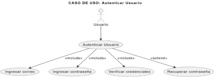*

   *Figura 02. Caso de Uso 002: Registrar usuario***\

   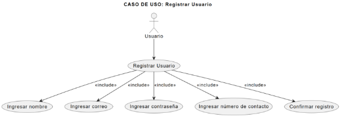
   **\
   `                                            `*Fuente: Elaboración Propia*

   *Figura 03. Caso de Uso 003: Registrar veterinario***\

   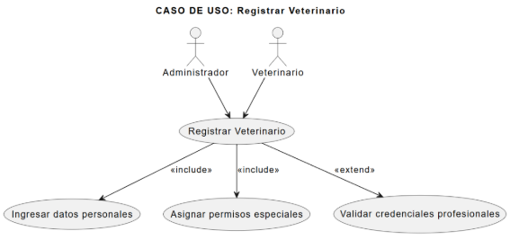

*Fuente: Elaboración Propia*

*Figura 04. Caso de Uso 004: Registrar reporte de mascota***\

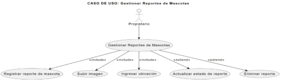

*Fuente: Elaboración Propia*

*Figura 05. Caso de Uso 005: Visualizar mascotas reportadas***\

*Fuente: Elaboración Propia*

*Figura 06. Caso de Uso 006: Comunicarse entre usuarios***\

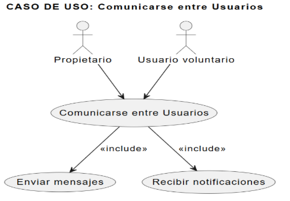

*Fuente: Elaboración Propia*

*Figura 07. Caso de Uso 007: Gestionar panel de usuario***\

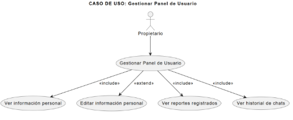

*Fuente: Elaboración Propia*

*Figura 08. Caso de Uso 008: Gestionar panel de veterinario***\

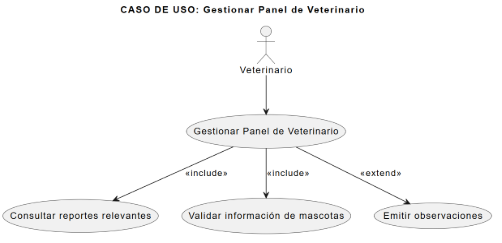

*Fuente: Elaboración Propia*

*Figura 09. Caso de Uso 009: Gestionar panel del administrador***\

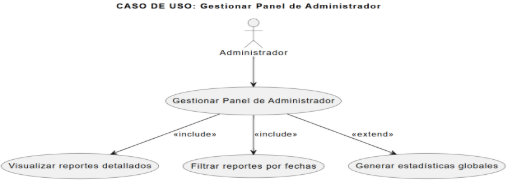

*Fuente: Elaboración Propia*

*Figura 10. Caso de Uso 010: Procesar imágenes con modelo preentrenado*

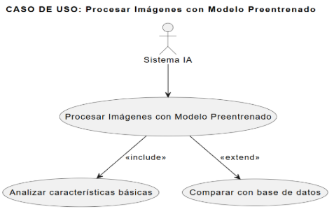

*Fuente: Elaboración Propia*

*Figura 11. Caso de Uso 011: Generar descriptores propios*

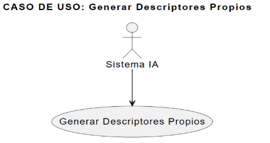

*Fuente: Elaboración Propia*

*Figura 12. Caso de Uso 012: Implementar algoritmo de matching y ranking***\

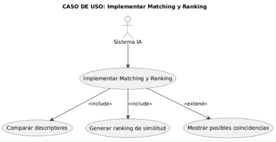

*Fuente: Elaboración Propia*

*Figura 13. Caso de Uso 013: Generar pipeline de validación de datos*

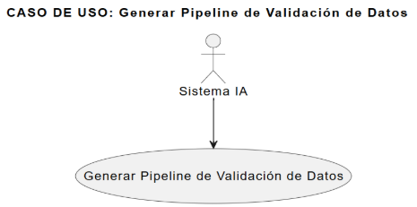

*Fuente: Elaboración Propia*

1. ## **Vista Lógica**
   1. **Diagrama de Subsistemas (paquetes)**
\*\

`	`*Figura 14. Diagrama de Subsistemas (paquetes)*

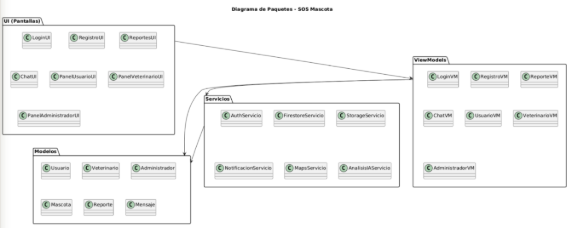

`	`*Fuente: Elaboración Propia*
1. ### **Diagrama Contextual**
   El diagrama de contexto del sistema SOS Mascota muestra una vista general de los principales actores y servicios externos que interactúan con la aplicación móvil.

- Propietario: es el actor que registra y gestiona reportes de mascotas perdidas. Su principal interacción con el sistema es crear reportes, adjuntar información y dar seguimiento a los casos.
- Usuario voluntario: consulta los reportes disponibles y puede registrar avistamientos de mascotas en la aplicación, aportando información útil para la búsqueda y posible reencuentro.
- Veterinario: accede al sistema para validar información de reportes y apoyar en la verificación de casos, garantizando mayor confiabilidad en la información registrada.
- Administrador: supervisa los reportes, gestiona estadísticas y tiene una visión global del sistema para asegurar su correcto funcionamiento.

El sistema central es la aplicación móvil SOS Mascota, la cual permite gestionar reportes de mascotas, registrar avistamientos, habilitar la comunicación entre usuarios y ofrecer paneles especializados según el tipo de actor.

Para su funcionamiento, la aplicación se apoya en tres servicios externos:

- Firebase: utilizado para la autenticación de usuarios, el almacenamiento de datos en la nube y el manejo de notificaciones en tiempo real.
- Google Maps API: provee geolocalización y mapas interactivos, facilitando la visualización de reportes y avistamientos.
- Servicio de IA: procesa imágenes de mascotas, genera descriptores y coincidencias para mejorar la precisión en la identificación de posibles reencuentros.

En conjunto, el diagrama ilustra cómo la aplicación SOS Mascota actúa como punto central de interacción, conectando a los diferentes actores humanos con los servicios tecnológicos que permiten la gestión eficiente de reportes de mascotas perdidas.

`	`*Figura 15. Diagrama de Contexto - SOS MASCOTA*

*Fuente: Elaboración Propia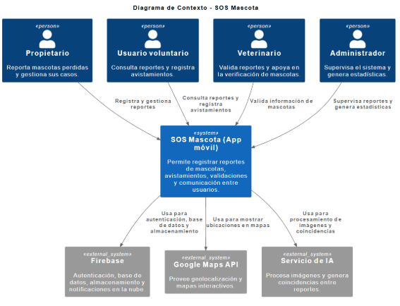*

1. ### **Diagrama de Clases**
`		`*Figura 16. Diagrama de Clases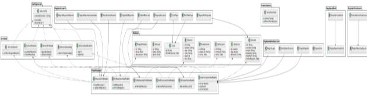*

*Fuente: Elaboración Propia*

1. ## **Vista de Procesos**
   
   1. ### **Diagrama de Proceso Actual**

`		`*Figura 17. Diagrama de Proceso Actual*

*Fuente: Elaboración Propia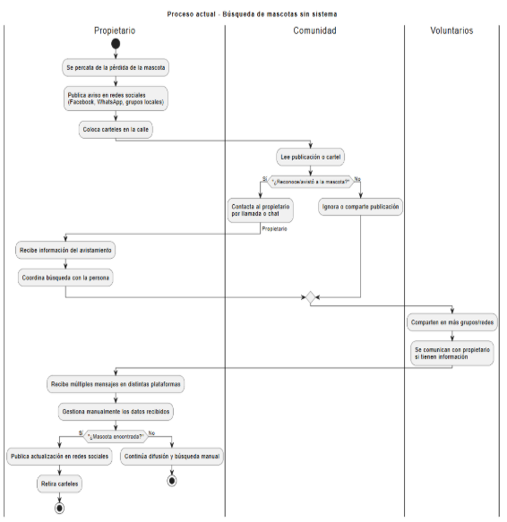*

1. ### **Diagrama de Proceso Propuesto**
\*		

`		`*Figura 18. Diagrama de Proceso Propuesto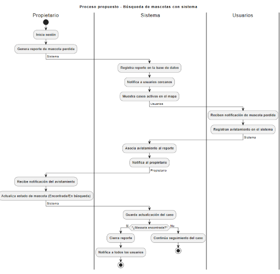*

*Fuente: Elaboración Propia*

1. ## **Vista de Despliegue**
   1. ### **Diagrama de Contenedor**
`		`*Figura 19. Diagrama de Contenedores - SOS MASCOTA*

`			`*Fuente: Elaboración Propia*
1. ## **Vista de Implementación**
   1. ### **Diagrama de Componentes**
`		`*Figura 20. Diagrama de Componentes*
\*\

1. ## **Calidad**
   1. ### **Escenario de Rendimiento**
      Descripción

      El sistema debe responder en menos de 5 segundos en las operaciones principales, como listar reportes de mascotas o cargar la ubicación en el mapa.

      Validación del escenario

- Origen del estímulo: Usuario consulta los reportes de mascotas perdidas.
- Estímulo: Solicitud de listar 50 reportes con imágenes y ubicación.
- Entorno: Red móvil 4G en horario de alta concurrencia.
- Artefacto: Aplicación móvil y base de datos (Firebase Firestore).
- Respuesta: El sistema devuelve la información solicitada en menos de 5 segundos.

Medida de la respuesta:

- Tiempo promedio de respuesta ≤ 5 segundos.
- 95% de las solicitudes completadas exitosamente dentro del tiempo esperado.

1. ### **Escenario de Usabilidad**
   ### Descripción
   ### La aplicación debe ser intuitiva y accesible, permitiendo que cualquier usuario sin experiencia pueda registrar un reporte en menos de 3 minutos y navegar entre pantallas en un máximo de 3 clics.
   ### Validación del escenario
- ### Origen del estímulo: Usuario nuevo abre la aplicación para registrar un reporte.
- ### Estímulo: Selección de la opción “Registrar reporte de mascota”.
- ### Entorno: Teléfono Android de gama media, primera vez de uso.
- ### Artefacto: Interfaz de usuario de la aplicación móvil.
- ### Respuesta: El usuario completa el registro del reporte sin ayuda externa.
### Medida de la respuesta
- ### Tiempo promedio de registro ≤ 3 minutos.
- ### Número máximo de clics por navegación ≤ 3.
- ### Tasa de éxito de usuarios ≥ 95%.
###

1. ### **Escenario de Disponibilidad**
   ### Descripción
   ### La aplicación debe estar disponible para los usuarios 24/7, salvo mantenimientos programados previamente notificados.
   ### Validación del escenario
- ### Origen del estímulo: Usuario abre la aplicación en cualquier momento del día.
- ### Estímulo: Solicitud de acceso a la aplicación.
- ### Entorno: Operación normal.
- ### Artefacto: Servidores en la nube (Firebase).
- ### Respuesta: La aplicación permite acceso inmediato al sistema.
### Medida de la respuesta
- ### Disponibilidad ≥ 99% mensual.
- ### Tiempo máximo de inactividad no planificada ≤ 10 hora al mes.

