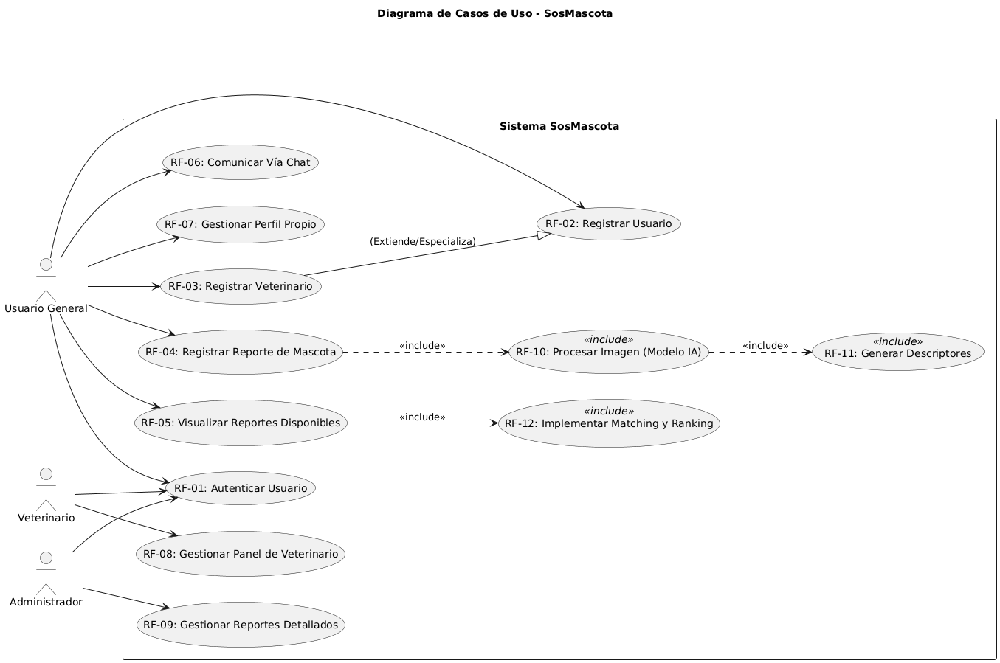
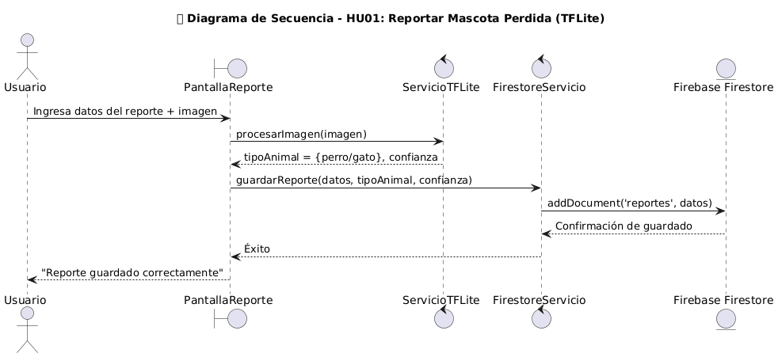
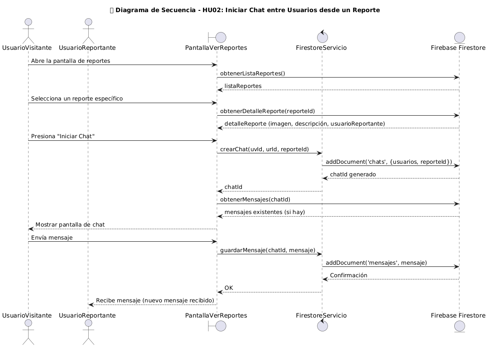
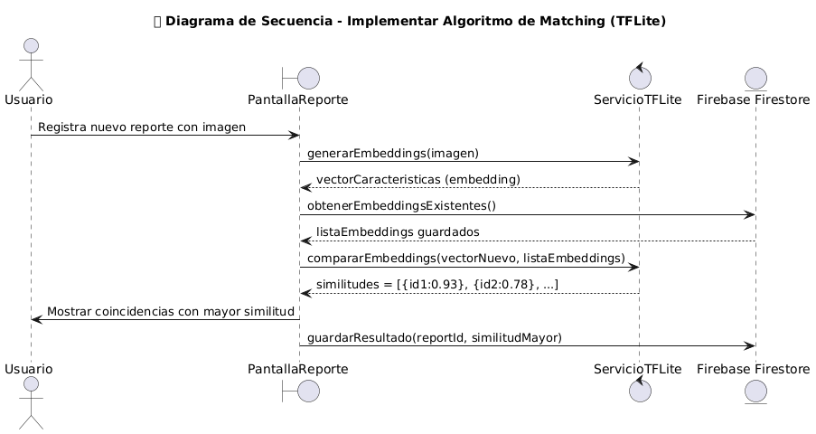
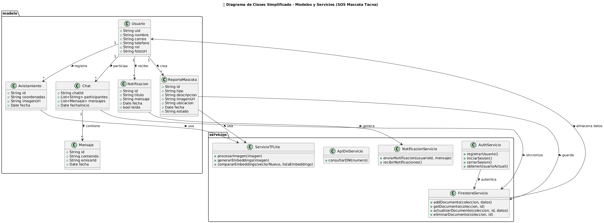
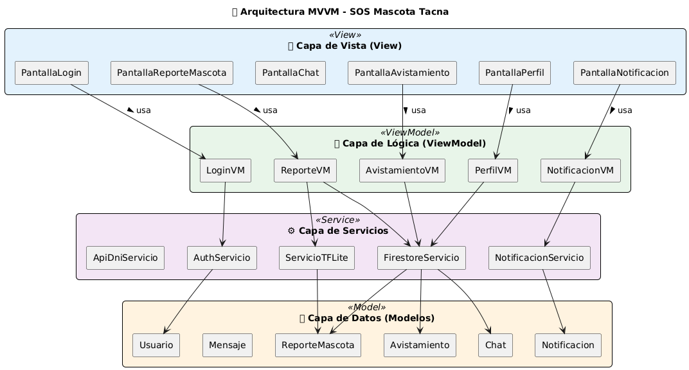
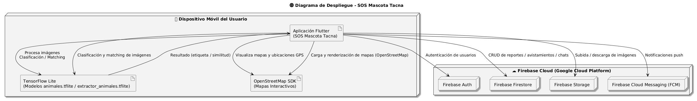
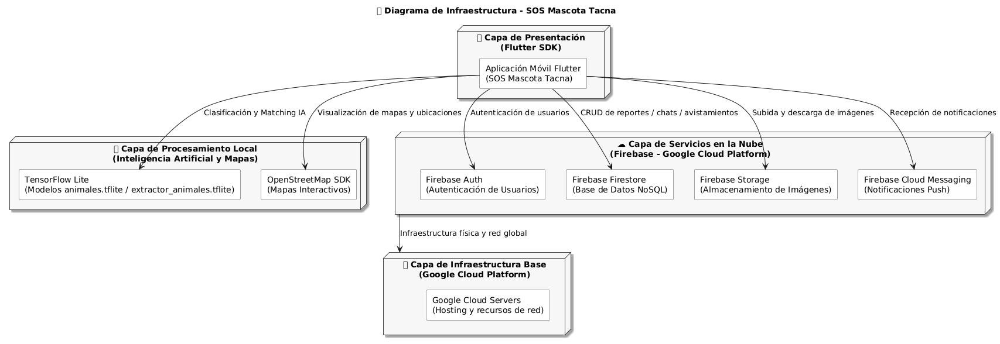

# 🐶 SOS Mascota Tacna

🔗 **Video Funcionamiento App SOS Mascota:** [https://youtu.be/q5smk8xjDO4](https://youtu.be/q5smk8xjDO4)

🔗 **Ver evidendencias de despliegue de App en otros dispositivos de estudiantes de la Upt:** [https://youtu.be/JPnnGd_emIo?si=jdu-8v0MOIeFXCKn](https://youtu.be/JPnnGd_emIo?si=jdu-8v0MOIeFXCKn)

### 📱 Aplicación móvil colaborativa para la localización de mascotas perdidas

Integrantes:

- Christian Dennis Hinojosa Mucho		(2019065161)
- Royser Alonsso Villanueva Mamani		(2021071090)
- Gilmer Donaldo Mamani Condori		    (2012042779)

---

## 📖 Descripción del Proyecto

**SOS Mascota Tacna** es una aplicación móvil desarrollada en **Flutter + Firebase**, creada para **ayudar a encontrar mascotas perdidas** mediante la colaboración ciudadana.

La app permite que los usuarios:
- Reporten **mascotas perdidas o encontradas** con imagen, descripción y ubicación GPS.  
- Reciban **notificaciones push** cuando se detectan coincidencias cercanas.  
- Se **comuniquen mediante chat** en tiempo real para coordinar rescates.  
- Usen **Inteligencia Artificial (TFLite)** para identificar el tipo de animal.  
- Participen en un **ranking colaborativo** de voluntarios confiables.

> Proyecto académico desarrollado para el curso **Calidad y Pruebas de Software – Universidad Privada de Tacna (UPT, 2025-II)**.

---

## 🎯 Objetivo

Brindar una solución tecnológica moderna y accesible que mejore la **efectividad de la búsqueda y rescate de mascotas**, fomentando la participación comunitaria y el uso responsable de la tecnología.

---

## 📲 Descarga y Acceso a Pruebas (Android)

Esta aplicación se encuentra en fase de **Prueba Interna en Google Play**. Para descargarla e instalarla en tu dispositivo Android, es necesario seguir estos pasos para obtener los permisos:

1.  **Paso 1: Unirse al Grupo de Testers (Obligatorio)** Primero debes unirte a nuestro grupo de Google para que la Play Store te reconozca como verificador.  
    🔗 **[Unirse al Grupo de Google - SOS Mascota](https://groups.google.com/g/testers-sos-mascota)** *(Clic en "Unirse al grupo")*

2.  **Paso 2: Descargar desde Google Play** Una vez dentro del grupo, usa este enlace para aceptar la invitación y descargar la app.  
    🔗 **[Descargar App en Google Play Store](https://play.google.com/apps/testing/com.smii.sosmascota)**

> **Nota:** Si el enlace de descarga muestra un error, asegúrate de haber completado el Paso 1 o abre el enlace en modo incógnito e inicia sesión con la cuenta que uniste al grupo.

---

## ⚙️ Tecnologías Utilizadas

| Categoría | Herramientas |
|------------|---------------|
| **Frontend móvil** | Flutter (Dart) |
| **Backend y base de datos** | Firebase (Firestore, Auth, Storage, FCM) |
| **IA local** | TensorFlow Lite |
| **Arquitectura** | MVVM + SOLID |
| **Control de versiones** | Git y GitHub |
| **Automatización CI/CD** | GitHub Actions |
| **Diseño UI/UX** | Material Design 3 + Lottie Animations |

---

## 🛡️ Calidad de Software y Pruebas Automatizadas (QA)

Para garantizar la fiabilidad y seguridad de **SOS Mascota Tacna**, se ha implementado un pipeline de **CI/CD con GitHub Actions** que ejecuta automáticamente análisis estático, escaneo de vulnerabilidades y pruebas en cada *push* al repositorio.

## 🔍 1. Calidad de Código y Seguridad (DevSecOps)

Herramientas utilizadas para asegurar un código limpio, robusto y libre de vulnerabilidades.

🔗 **Github Page** [https://upt-faing-epis.github.io/proyecto-si784-2025-ii-u3-sos_mascota/](https://upt-faing-epis.github.io/proyecto-si784-2025-ii-u3-sos_mascota/)

| Herramienta | Tipo de Análisis | Estado | Reporte Detallado |
| :--- | :--- | :---: | :--- |
| **SonarCloud** | Calidad de Código, Bugs y Code Smells | ✅ **Passed** | [Ver Dashboard Sonar](https://sonarcloud.io/project/overview?id=dennisdhm7_proyecto_sosmascota) |
| **Semgrep** | Seguridad Estática (SAST) | ✅ **0 Issues** | [Ver Reporte HTML](https://upt-faing-epis.github.io/proyecto-si784-2025-ii-u3-sos_mascota/reports/semgrep.html) |
| **Trivy** | Seguridad de Dependencias (SCA) | ✅ **Clean** | [Ver Reporte HTML](https://upt-faing-epis.github.io/proyecto-si784-2025-ii-u3-sos_mascota/reports/trivy.html) |
| **Mutation Test** | Pruebas de Mutación (Dinámico) | ✅ **Passed** | [Ver Reporte HTML](https://upt-faing-epis.github.io/proyecto-si784-2025-ii-u3-sos_mascota/reports/mutation/index.html) |

> **Nota:** Los reportes HTML son generados automáticamente y desplegados en GitHub Pages mediante el workflow de integración continua.
>
> **Actualización:** Se ha reemplazado la herramienta **Snyk** por **Trivy** para la gestión y escaneo de vulnerabilidades en dependencias.

---

## 🧪 2. Pruebas Unitarias (Unit Testing)

Se han desarrollado pruebas unitarias para validar la lógica de negocio y los ViewModels, asegurando que las funciones críticas (como la detección de IA o el cálculo de coincidencias) funcionen correctamente.

* **Comando:** `flutter test --coverage`
* **Cobertura:** Reporte generado con `ReportGenerator`.

📊 **[Ver Reporte de Cobertura y Riesgo](https://upt-faing-epis.github.io/proyecto-si784-2025-ii-u3-sos_mascota/reports/risk_report/index.htm)**

---

#  FD02 – Wiki y el RoadMap
📘 **Wiki del Proyecto:**  
➡️ [Home](https://github.com/UPT-FAING-EPIS/proyecto-si784-2025-ii-u2-sosmascota/wiki)  
➡️ [Roadmap](https://github.com/UPT-FAING-EPIS/proyecto-si784-2025-ii-u2-sosmascota/wiki/Roadmap)  
➡️ [Tecnologías](https://github.com/UPT-FAING-EPIS/proyecto-si784-2025-ii-u2-sosmascota/wiki/Tecnologias)  

---
# 🧠 FD03 – Historias de Usuario, Criterios de Aceptación y Escenarios de Prueba (TensorFlow Lite)

Este documento presenta las **historias de usuario**, **criterios de aceptación** y **escenarios de prueba** del módulo de **TensorFlow Lite (TFLite)** utilizado en la aplicación **SOS Mascota Tacna**, específicamente en las funciones de **reporte de mascota** y **chat entre usuarios**.

El modelo **TFLite** permite clasificar imágenes localmente (perro o gato) y analizar similitudes entre fotografías para facilitar la búsqueda de coincidencias entre reportes.

---

## 🐾 HU01 – Reportar Mascota Perdida (Clasificación con TFLite)

**Como** usuario registrado,  
**Quiero** que la aplicación analice la imagen de mi mascota utilizando el modelo **TFLite**,  
**Para** que el sistema determine automáticamente si es un perro o un gato y mejore el proceso de búsqueda.

### ✅ Criterios de Aceptación
- CA1. El modelo `animales.tflite` debe ejecutarse localmente al subir una imagen.  
- CA2. La predicción debe devolver la etiqueta (“perro” o “gato”) y un porcentaje de confianza.  
- CA3. Si la confianza es menor al 70%, el sistema debe solicitar una nueva imagen.

### 🧪 Escenarios de Prueba
**Escenario 1:**  
Dado que el usuario selecciona una foto clara de su mascota,  
Cuando el sistema ejecuta el modelo `animales.tflite`,  
Entonces el sistema muestra el resultado **“Perro detectado (94%)”** y permite continuar con el registro del reporte.  

**Escenario 2:**  
Dado que el usuario sube una imagen borrosa o con bajo contraste,  
Cuando el modelo `animales.tflite` intenta procesarla,  
Entonces la confianza cae por debajo del 70% y la app muestra el mensaje:  
> “Imagen no reconocida. Intenta subir una foto más clara.”

---

## 💬 HU02 – Chat entre Usuarios (Coincidencia de Reportes con TFLite)

**Como** usuario que conversa con otro mediante el chat,  
**Quiero** que el sistema use el modelo **TFLite** para comparar las imágenes de nuestros reportes,  
**Para** detectar si las mascotas corresponden al mismo animal y facilitar el reencuentro.

### ✅ Criterios de Aceptación
- CA1. El sistema debe comparar los vectores de características (embeddings) generados por `extractor_animales.tflite`.  
- CA2. Si la similitud entre las imágenes es mayor o igual al 85%, debe mostrarse una alerta visual dentro del chat.  
- CA3. Si la similitud es baja, el sistema continúa la conversación sin generar alerta.

### 🧪 Escenarios de Prueba
**Escenario 1:**  
Dado que dos usuarios intercambian imágenes de mascotas similares,  
Cuando el modelo `extractor_animales.tflite` calcula una similitud del **91%**,  
Entonces la app muestra un mensaje en el chat:  
> “🐾 Posible coincidencia detectada entre las mascotas enviadas.”  

**Escenario 2:**  
Dado que las imágenes comparadas son de animales distintos,  
Cuando el modelo ejecuta la comparación,  
Entonces la similitud es menor al 50% y el sistema no muestra ninguna alerta.

---
## 🧠 FD04 – Diagrama de caso de uso - Diagrama de Secuencia - Diagrama de clases - Diagrama de despliegue - Diagrama de infraestructura
---

### 🧩 Diagrama de Casos de Uso General

Muestra las interacciones principales entre los actores (**Usuario**, **Administrador** y **Visitante**) con las funciones del sistema.

---

### 🐾 HU01 – Reportar Mascota Perdida (Clasificación con TFLite)

Representa el flujo de registro de un reporte de mascota.  
El sistema procesa la imagen con el modelo `animales.tflite` para identificar si es perro o gato y luego guarda la información en Firestore.

---

### 💬 HU02 – Iniciar Chat entre Usuarios desde un Reporte

Cuando un usuario visualiza un reporte, puede iniciar un chat con el reportante.  
El sistema crea o reutiliza una conversación, guarda los mensajes en Firestore y envía notificaciones push.

---

### 🤖 HU03 – Implementar Algoritmo de Matching (TFLite)

Muestra cómo el sistema utiliza el modelo `extractor_animales.tflite` para generar embeddings y comparar imágenes, identificando coincidencias con un umbral de similitud mayor o igual al 85%.

---
### 🧩 Diagrama de Clases – Estructura Lógica del Sistema

Representa las clases principales del sistema **SOS Mascota Tacna**.

---

### 🧱 Diagrama de Arquitectura 

Este diagrama muestra la **distribución de la arquitectura del sistema movil**

---
### 🌐 Diagrama de Despliegue

---
### 🌐 Diagrama de Infraestructura – Servicios y Comunicación

Este diagrama refleja cómo se **interconectan los servicios en la nube** y los recursos locales que componen la infraestructura del proyecto.

---

### 🧾 Resumen Final – FD04

| Nº | 🧩 Tipo de Diagrama | 📁 Archivo | 📖 Descripción Breve |
|:--:|----------------------|-------------|----------------------|
| 1️⃣ | **Diagrama de Casos de Uso General** | `diagrama_casos_usos.png` | Representa las interacciones entre actores (usuario, visitante, administrador) y las funciones principales del sistema. |
| 2️⃣ | **Diagrama de Secuencia HU01 – Reportar Mascota Perdida** | `secuencia_1.png` | Muestra el flujo para registrar una mascota perdida con procesamiento de imagen mediante IA local (TFLite). |
| 3️⃣ | **Diagrama de Secuencia HU02 – Iniciar Chat entre Usuarios** | `secuencia_2.png` | Detalla la comunicación entre un usuario visitante y el reportante a través del chat en Firestore. |
| 4️⃣ | **Diagrama de Secuencia HU03 – Algoritmo de Matching (TFLite)** | `secuencia_3.png` | Explica el proceso de comparación de imágenes mediante embeddings generados por TensorFlow Lite. |
| 5️⃣ | **Diagrama de Clases – Estructura Lógica del Sistema** | `diagrama_clases.png` | Define las entidades principales (`Usuario`, `ReporteMascota`, `Chat`, `Mensaje`, etc.) y sus relaciones con los servicios Firebase. |
| 6️⃣ | **Diagrama de Arquitectura – MVVM** | `diagrama_arquitectura.png` | Describe la arquitectura por capas del sistema móvil basada en el patrón MVVM (View, ViewModel, Model, Servicios). |
| 7️⃣ | **Diagrama de Despliegue Total (Firebase, TFLite, OSM)** | `diagrama_despliegue.png` | Muestra la distribución física de componentes entre la app Flutter, Firebase Cloud y los módulos locales de IA y mapas. |
| 8️⃣ | **Diagrama de Infraestructura – Servicios y Comunicación** | `diagrama_infraestructura.png` | Ilustra las capas tecnológicas y la comunicación entre Flutter SDK, Firebase, TensorFlow Lite y OpenStreetMap. |

---

